<h1 align="center">COMS3011 - Software Design Project</h1>


<p align="center">
  
</p>


<h3 align="center">(Project 3 - Event Planning)</h3> 

##### Student numbers:
- 2430285 
- 2667194 
- 2671832 
- 2702445 
- 2538031 
- 2604668

---

## **Purpose**

Vows & Veils was created to allow smooth wedding planning by providing a centralized platform for couples, their guests and wedding vendors. Planning a wedding can be overwhelming, with many details to manage and guests to coordinate. So, we set out to build a simple, smart, and supportive solution.

The goal was to build a simple, intuitive site where couples could effortlessly organize every aspect of their wedding day, from guest RSVPs to venue and vendor selections, while guests can quickly confirm attendance without any unnecessary hassle. Wedding venue and vendor companies can also join Vows & Veils to showcase their offerings and allow couples to select their perfect options directly through the platform. 

With Vows & Veils, everything is kept in one place to help couples stay on track. We focused on user-friendly design and smart features like real-time weather updates, countdown timers, and a venue recommendation system to take the stress out of wedding planning. 
Whether a user is a couple planning their wedding, a guest attending an event, or a company offering services, Vows & Veils provides a centralized platform to manage and coordinate all aspects of the wedding process efficiently and effectively.

## **External Access Links**

1. **Publicly hosted application**
    
    Live URL - Deployed web app (Azure):     
    [https://mango-mushroom-00c4ce01e.2.azurestaticapps.net/](https://mango-mushroom-00c4ce01e.2.azurestaticapps.net/)

2. **Github Repository**
   
    Repository link:     
    [https://github.com/Pixel-Perfect-SDP/Vows-n-Veils?tab=readme-ov-file](https://github.com/Pixel-Perfect-SDP/Vows-n-Veils?tab=readme-ov-file)


---
## **Admin Access**
Admin email address:pixelperfsdp@gmail.com

Admin password: PixelPerfect123

---
<a id="work-planning"></a>
## Work planning

We adhered to the Scrum methodology throughout the project, utilizing Notion as our primary workspace for planning and progress tracking. The structure is organized as follows:

### Scrum Board (Notion)

The board comprises our product backlog, sprint backlog, and task progress tracking. It is organized by the sprint in which each task was completed and displays a short description of the task, the team members assigned to each task as well as deadlines for tasks.

Link: [https://pinnate-diagram-9fc.notion.site/23c2a298f77b8092b383e89d1aeef147?v=23c2a298f77b80b08156000cb5d7c620&source=copy_link](https://pinnate-diagram-9fc.notion.site/23c2a298f77b8092b383e89d1aeef147?v=23c2a298f77b80b08156000cb5d7c620&source=copy_link)

### Scrum Ceremonies (Notion)

This page documents all of our Scrum ceremonies, including sprint planning, daily stand-ups, sprint retrospectives, and sprint reviews. It contains meeting notes, and key decisions made throughout the process.

Link: [https://pinnate-diagram-9fc.notion.site/Scrum-23c2a298f77b8035a54cdb1291535c77?source=copy_link](https://pinnate-diagram-9fc.notion.site/Scrum-23c2a298f77b8035a54cdb1291535c77?source=copy_link)

### Proof of Scrum Methodology

#### Sprint 1:

We used a Notion board to track our tasks throughout the first sprint. The screenshot below shows completed tasks, demonstrating that the plan was actively used by all members of the team.


We recorded all planning meetings for Sprint 1 in Notion. The screenshot below demonstrates that the team discussed the plan for the sprint thoroughly.


#### Sprint 2:
We continued to use a Notion board to track our tasks throughout the second sprint. The screenshot below shows completed tasks, demonstrating that the plan was actively used by all members of the team.

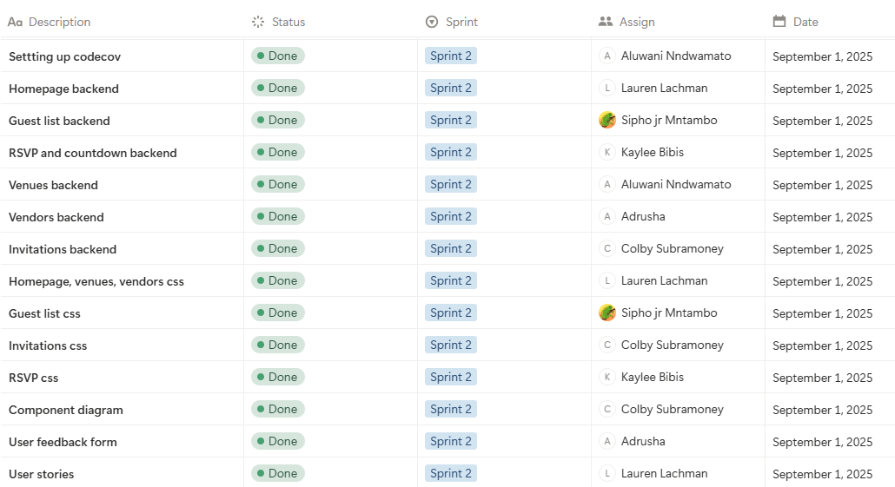
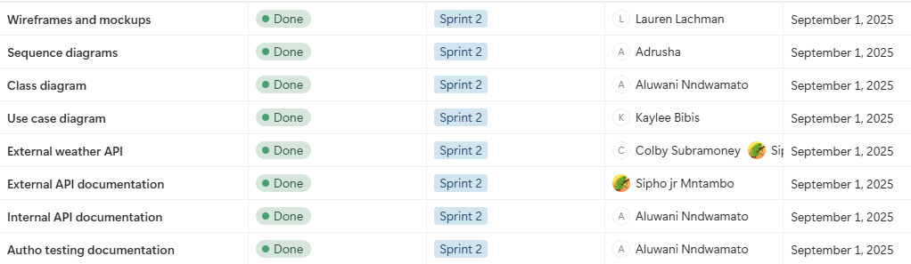

We recorded all planning meetings for Sprint 2 in Notion. The screenshot below demonstrates that the team discussed the plan for the sprint thoroughly.


#### Sprint 3
We continued to use a Notion board to track our tasks throughout the third sprint. The screenshot below shows completed tasks, demonstrating that the plan was actively used by all members of the team.
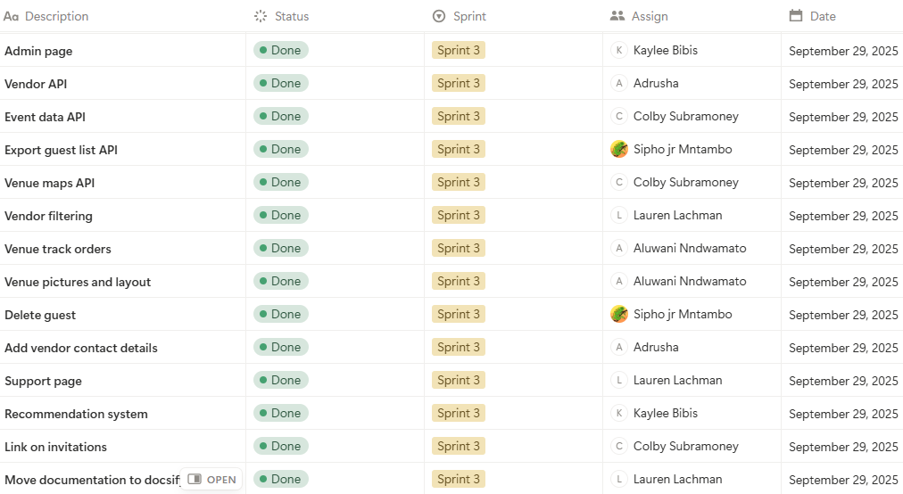
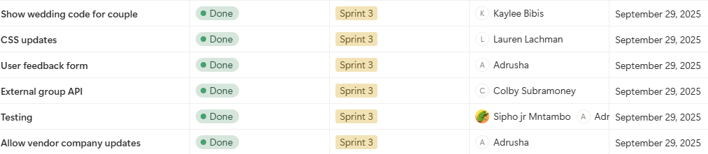

We recorded all planning meetings for Sprint 3 in Notion. The screenshot below demonstrates that the team discussed the plan for the sprint thoroughly.

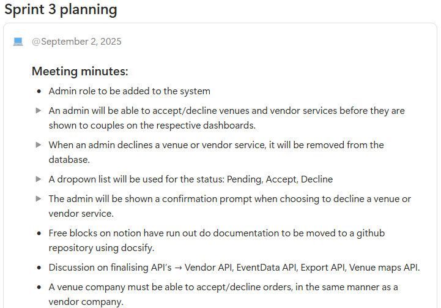
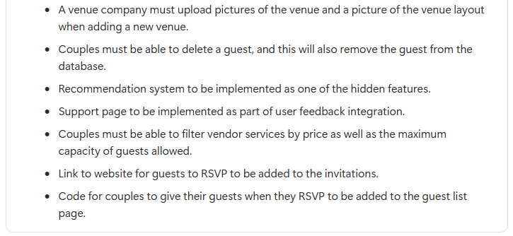


#### Sprint 4
We continued to use a Notion board to track our tasks throughout the fourth sprint. The screenshot below shows completed tasks, demonstrating that the plan was actively used by all members of the team.

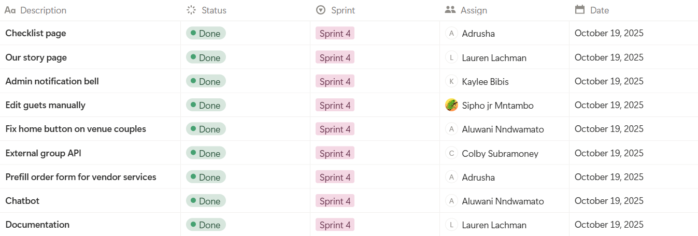

We recorded all planning meetings for Sprint 4 in Notion. The screenshot below demonstrates that the team discussed the plan for the sprint thoroughly.

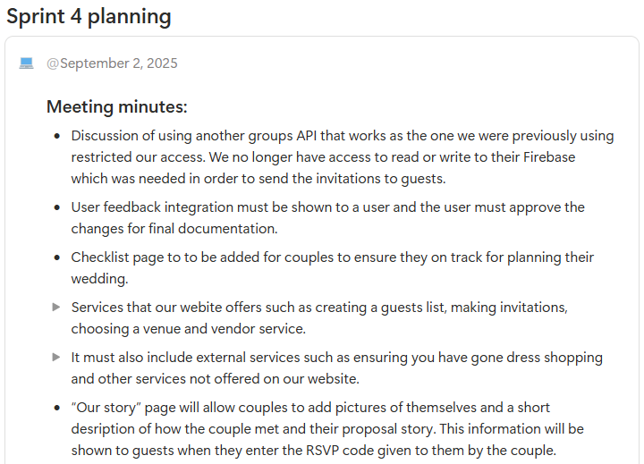
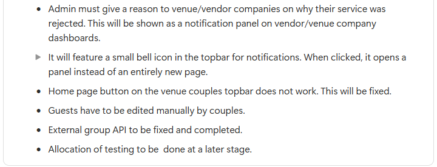

---


## **Development Guides**

### **Creating a development database:**

1. Set up a firebase project by going to the Firebase Console and creating a new project.
2. Configure the firestore database by navigating to the Firestore Database inside the project and creating a Firestore instance in test mode for development.
3. Add authentication by enabling authentication methods. This is done by navigating to **Authentication → Sign-in method**
4. Get Firebase Config by navigating to the project settings and copying the Firebase SDK config object. This is done by navigating to **Project Settings → SDK Setup and Configuration**
5. Update the angular environment by pasting the Firebase config into the Angular project’s environment files. **(src/environment/environment.ts and environment.prod.ts)**

### **Creating a development API:**

1. Install Firebase CLI by running the following command: **npm install -g firebase-tools**.
2. Login by running **firebase login**.
3. Initialize cloud functions in the project folder by running **firebase init functions**. 
4. Develop functions locally using the emulator by running **firebase emulators:start** to run functions locally for testing.
5. Deploy functions to firebase using the following command: **firebase deploy –only functions**.

### **Creating a development site:**

1. Clone the github repository using the following command: **git clone https://github.com/Pixel-Perfect-SDP/Vows-n-Veils.git**.
2. Navigate to the project folder and install Angular dependencies by running **npm install**.
3. Configure the environment by ensuring that **src/environments/environment.ts** contains the Firebase config for development.
4. Run the Angular development server locally by running **ng serve**. In the browser, open “[http://localhost:4200](http://localost:4200/)”
5. Deploy to Azure by building the production version and running **ng build –prod** and deploy the generated files to the Azure Web App.

---

## Git Methodology

Our team used Git for version control to manage and collaborate on the wedding planning platform project. By following this methodology, we maintained a clean, organized, and collaborative codebase that supports efficient teamwork and reliable delivery.

### **Branching strategy**

We followed a feature-branch workflow, where all developments for new features or enhancements occured on dedicated branches that were separate from the main branch. This approach ensures that the main branch always containd stable, working code and allowed team members to efficiently work independently.

The main branch, “main” would always contain production ready code. Feature branches, for example “feature/countdown” were used for developing and testing new features. Each feature branch had a clear description named according to the work being done by a member. Feature branches were named as “feature/<name>” where <name> is the feature being worked on.

**Creating and working on a branch:**

1. Pull the latest changes from main by running the command **git pull origin main**.
2. Create a new branch for a specific task by running the command **git checkout -b feature/name** 
3. Make changes and commit frequently with clear messages.
4. Push the branch to the remote repository by running the command **git push origin feature/name**.
5. Open a pull request that targets “main” and request a team review.
6. Merge the branch into main once it has been approved.

**Workflow reference:**

[https://www.atlassian.com/git/tutorials/comparing-workflows/feature-branch-workflow](https://www.atlassian.com/git/tutorials/comparing-workflows/feature-branch-workflow)

### **Commit messages**

We followed a consistent commit message style, which helped to keep the history of the project clear and meaningful. Commit messages used present tense when describing work done and changes made, including additional details if needed, reference related issues and had a single logical change. Commits were made after each logical change and not at the end of a large task.

An example of a commit message is “Add button for product update”.

### **Collaboration and code review**

All code changes were made via Pull Requests. Team members reviewed each Pull Request to ensure code quality and functionality before merging. We also used GitHub Issues to track bugs throughout the project. Any merge conflicts that arised throughout the project were discussed and resolved between team members before pushing changes.

### **Tool and resources**

- Github: Repository hosting, pull requests, issue tracking
- CI/CD: Github Actions pipelines run tests on branches and pull requests to main code integrity.

---

## Technology Stack

For this project we selected the following technology stack:

### **Frontend: Angular (with HTML, CSS, and JavaScript )**

We chose to use Angular to broaden our knowledge as web application developers and to gain experience using a framework that none of our group members had previously used.

After researching we found that Angular provides many different libraries that would be useful in simplifying the development process and enhancing the functionality of our application.

In addition to Angular:

- CSS would help greatly with the visual design and overall presentation of our web application.
- HTML is the standard language used when creating a Web App as it gives the skeleton of the web page and is an essential framework for content organization.
- JavaScript gives the basic interactivity and dynamic behavior we will need in our web app to create a responsive and engaging user experience.

### **Backened: Node.js**

We chose node.js for the backend as it is one of the most widely used backend technologies, therefore ensuring a wide variety of documentation, community support, and resources available if we run into challenges throughout the project.

**Node.js** offers the advantage of being consistent in terms of the backend and the frontend, which both use JavaScript. There are also many packages available to use with Node.js via the npm or Node Package Manager, which provide access to several tools and libraries that will streamline development and enhance the functionality of our web application.

### **Database: Firebase**

We decided to use Firebase as our database for this project as many of our group members were familiar with the platform through previous projects. This prior experience allowed us to work more efficiently and use existing knowledge.

Firebase also simplified Authentication as it provided built-in functionality that ensured security. In addition Firebase offered a centralized environment for managing the projects data collections and tables in a single centralized database.

### **Hosting and Infrastructure: Microsoft Azure**

We decided to use Microsoft Azure for the hosting and infrastructure.. As students at the University of the Witwatersrand we are allocated credits which we used to deploy the static web application without additional costs.

Our team also had prior experience using Azure and were easily able to link it to our GitHub repository as we had successfully implemented it before in previous projects.

---

## Project management methodology

### **Chosen Methodology: Scrum**

For this project, we chose to adopt the Scrum methodology, an Agile framework that is well-suited for managing complex, and evolving projects like our wedding planning platform. Scrum emphasizes iterative development, collaboration, and continuous feedback, which allowed our team to maintain flexibility as the project progresses.

Scrum was selected because it allowed for effective teamwork through defined roles, regular ceremonies and meetings, and sprints within a certain timeframe. This structure allowed us to break down the project into manageable tasks and adapt to changes efficiently. The frequent reviews and retrospectives ensured quality and alignment with project goals throughout the development cycle.

**Methodology references:**

- Scrum guide: [https://www.projectmanager.com/blog/guide-to-scrum-ceremonies](https://www.projectmanager.com/blog/guide-to-scrum-ceremonies)
- Agile framework: [https://www.mendix.com/agile-framework/](https://www.mendix.com/agile-framework/)

### **Tools used: Notion**

We used Notion as our primary workspace for planning and tracking tasks throughout the project. Notion allowed us to centralize project artifacts and allow collaboration for organization and transparency.

Our Notion board includesd a product backlog and sprint backlogs, organized by sprint cycles. Each task was assigned to team members with a status which was updated as the sprint progresses. This task tracking board allowed clear visibility into workload progress.

We documented all Scrum ceremonies including daily stand-ups, sprint planning, sprint reviews, and sprint retrospectives on Notion. This included meeting notes, summaries and key decisions made, which allowed us to maintain accountability and facilitate continuous improvement.

**Scrum Board (Notion):**

[https://pinnate-diagram-9fc.notion.site/23c2a298f77b8092b383e89d1aeef147?v=23c2a298f77b80b08156000cb5d7c620&source=copy_link](https://pinnate-diagram-9fc.notion.site/23c2a298f77b8092b383e89d1aeef147?v=23c2a298f77b80b08156000cb5d7c620&source=copy_link)

**Scrum Ceremonies (Notion):**

[https://pinnate-diagram-9fc.notion.site/Scrum-23c2a298f77b8035a54cdb1291535c77?source=copy_link](https://pinnate-diagram-9fc.notion.site/Scrum-23c2a298f77b8035a54cdb1291535c77?source=copy_link).

### **Project procedure**

We planned the project in timed sprints. At the start of each sprint, we held a sprint planning meeting in order to select backlog items to complete and assign tasks to members for that sprint. Daily stand-up meetings were held to synchronize team work, discuss progress and identify obstacles that team members may be facing. Tasks were regularly tracked on the Notion task board to reflect its current status and ensure accountability. At the end of the sprint, sprint reviews and sprint retrospectives allowed us to demonstrate progress, gather feedback and discuss improvements for future sprints. Git and Github were used for version control, managing feature branches and collaboration on code.

This structured approach allowed us to deliver work iteratively and adapt to changes while still maintaining team alignment throughout the project.

---

## Initial design and Development plan

### **Purpose and objective**

Vows & Veils is a centralized platform that simplifies wedding planning for couples and makes RSVP management seamless for guests. Couples can plan every aspect of their wedding, from tracking RSVPs to selecting venues and vendor services. Guests can easily confirm attendance and provide necessary details, without unnecessary steps or confusion. The platform also allows companies, such as wedding venues and vendors, to offer their services directly on the site, enabling couples and guests to select and manage services efficiently.

### **Core features**

For guests:

- A dedicated RSVP page that does not require signing in.
- Input fields: Full name and surname, dietary requirements and allergies, song requests, attendance confirmation (yes/no).
- Code entry for confirmed attendees which has been provided by the couple.

For couples:

- Secure login using Google sign-in.
- Create an event page with required fields: full names of the couple, wedding date, selected venue, budget, custom event code, preferred vendors.
- A wedding checklist with essential tasks for couples to stay on track.
- Venue recommendation system.
- Countdown timer to the wedding day.
- Real-time weather updates for the venue.

For companies:

- Secure login using Google sign-in.
- Create a new company with required fields: company name, contact details.
- Add new venues or vendor services to company profile.
- Track orders made by couples and be able to accept/reject orders.

### **Technical approach**

**Frontend:**

The frontend is responsive and user friendly. It has separate interfaces for guests, couples, and companies. It includes a guest manager which will allow couples to view RSVPs and invite guests, a guest RSVP portal which allows guests to quickly RSVP to a wedding, and company dashbaords which allow companies to add their services on to the site.

**Backend and Database:**

Firebase was used for authentication and real-time data. There are database components for guests, vendors, events and files. External APIs were used for live-weather updates and venue additions for companies.

API’s and integrations:

- GuestList API - Add, update, and retrieve guest details and RSVP status.
- Vendor API– Manage venues, catering, and other services.
- EventData API– Event metadata.
- Export API– Provide downloadable event data.

### **Development roadmap**

The goal of the development roadmap was to outline a clear, step-by-step approach for building the wedding planning platform from initial setup to final launch, seperate from sprint goals. It broke the project into manageable phases within our sprints, ensuring that core features are developed first, followed by enhanced features and functionality. This structured approach helped maintain focus, and ensured that each goal delivers value, leading to a user-friendly platform that met the needs of both couples and guests.

| **Phase** | **Goals** | **Deliverables** |
| --- | --- | --- |
| 1 - Core structure | - Firebase setup <br> - Github setup <br> - Azure deployment <br> - Google sign-in and homepage UI | Working sign-in that leads to an event creation page |
| 2 - Event creation | - Create an event page <br> - Invitation creation page <br> - Add guests page <br>-  RSVP portal| Couples can create and manage an event |
| 3 - Enhanced features | - Countdown timer <br> - Real-time weather API <br> - Vendor integration <br> - Venue integration| Fully functional planning tools |
| 4 - Advanced tools | - Guest list export as PDF/CSV <br> - Venue recommendation system  <br> - Wedding checklist page <br> - Couple story page | Advanced features added to product |
| 5 - Testing | - Bug fixes <br> - UI polish | Most features completed |
| 6 - Launching | - Final touches | Platform is ready to launch |


### **Wireframes and Mockups**

<u>Couples homepage:</u>


<u>Guest list page:</u>


<u>Invitations page:</u>


<u>Landing page:</u>


<u>Login page:</u>


<u>RSVP page:</u>


<u>Story page:</u>


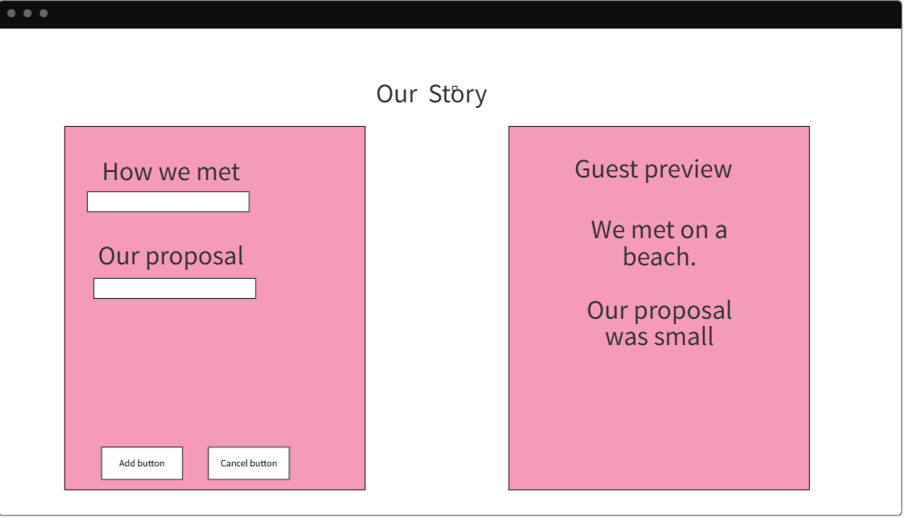

<u>Support page:</u>

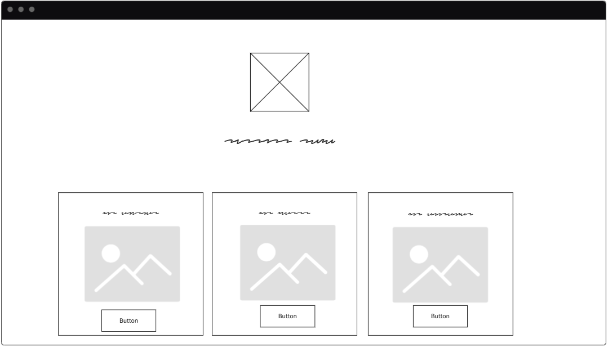
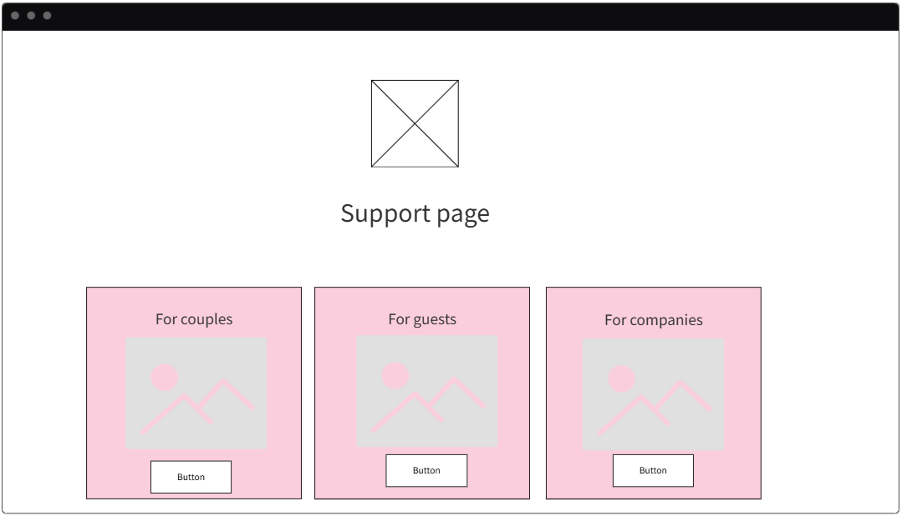

<u>Vendor companies dashboard:</u>


<u>Venue companies dashboard:</u>


<u>Vendors for couples page:</u>


<u>Venues for couples page:</u>


---

## Design documents

**Deployment diagram:**


Component diagram:


Use case diagram:


Class diagram:

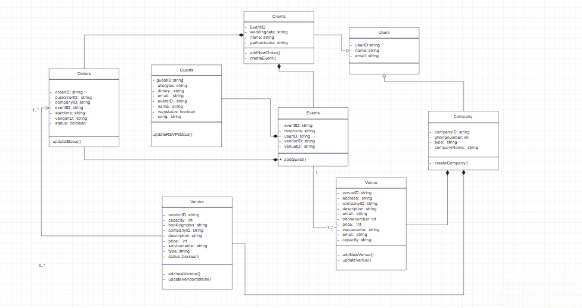

**Sequence Diagrams:**

Homepage → Routes: page load (directed to event form or homepage)


Homepage → Event creation


Vendor-company page→ Updating the order status


Vendor-couples page → ordering vendors


Invitations page → Page load(with only events and venues on invitation)


Invitations page → Template Selection and Change of Template


---

## User stories and their accompanying user acceptance cases

### Sprint 1

1. As a user who wants to plan their wedding, I am able to see short summaries of options available on the landing page so that I can quickly understand what services are offered and decide where to start.
    
    **User Acceptance Tests:**
    
    - Given I am a visitor on the website, when the landing page loads, then I should be able to see available wedding planning options.
    - Given I am on the landing page and it has loaded, when the options are displayed, then each option should include a short summary describing the service.
    - Given the planning options and their accompanying summary has loaded and is displayed on the landing page, when I read them, then the text should be legible and easy to understand.

2. As a user who wants to plan my wedding, when I click the "Go to Login" button, a new page should load that shows a Google Sign-In button so that I can log in quickly using my Google account.
    
    **User Acceptance Tests:**
    
    - Given I am on the landing page, when I click the “Go to Login” button, then a new page will load without errors.
    - Given the Google Sign-In button is visible, when I click it, then I should be directed to the Google authentication page.
    

### Sprint 2

1. As a user looking to plan my wedding, I want to be redirected to the homepage when I sign in for the first time, so that I can create my wedding by inputting required details such as names, date, and time.

**User Acceptance Tests:**

- Given I am a new user, when I sign up and am successfully authenticated, then I should be redirected to the homepage.
- Given that I have successfully signed in and am on the homepage, when it is my first time signing in, then I will see a form displayed allowing me to enter my wedding details, such as names, and wedding date and time.
- Given I am a user who is creating my wedding, when I am filling out the wedding details form and a required input field is not completed, then the submit button will be disabled, preventing me from submitting my details.
- Given I am a user who is creating my wedding, when I have filled out the wedding details form and all input fields are valid, then the submit button will be enabled, allowing me to confirm my details.

2. As a user who has successfully created their wedding event, I want to be redirected to the homepage when I sign in, so that I can see a personalized welcome message and a sidebar that allows me to navigate to other pages.

**User Acceptance Tests:**

- Given that I have already created my wedding event, when I sign in, then I am redirected to the homepage.
- Given I am on the homepage after signing in and have already created my wedding event, when the dashboard loads, then a sidebar is displayed with links to other pages, such as guest list, invitations, vendors, and venues.
- Given I am on the homepage and have already created an event, when the pages loads, then I will see a welcome message that includes mine and my partner’s names.
- Given I am on the homepage and see the links on the sidebar, when I click on a link, then I am navigated to the corresponding page without errors.

3. As a couple looking to choose a wedding venue, I want to click on the “Venues” link in the sidebar so that I am redirected to a page displaying the different venue options available to me.

**User Acceptance Tests:**

- Given I am signed in and am on the homepage, when I click the “Venues” link on the sidebar, then I will be successfully redirected to the venues page with no errors.
- Given I am on the venues page, when the page loads, then I will see a list of available venues with their address, venue capacity, and a button to show more details about the venue.
- Given I am on the venues page, when I scroll through the list of available venue options, then all venues are displayed in a clear layout that is easy to understand.

4. As a couple browsing venues on the venues page, I want to click a button to see more details about a particular venue, so that I can view the venue’s details in a clear format and choose that venue as my wedding venue.

**User Acceptance Tests:**

- Given I am on the venues page, when I click the “View venue” button for a specific venue, then I am shown the full details of that venue in a logical, organized format.
- Given I am viewing a venue’s details, when I review the information, then I can see all relevant information such as name, location, capacity, price, images, and contact details for the venue company.
- Given I have selected a venue, when I return to the venues page, then the selected venue is shown in a seperated section.
- Given I am on the venues page, when I navigate back to the venues list or to the homepage, then the navigation works correctly without errors and my venue selection is retained.

5. As a couple looking to design our wedding invitation, I want to click the “Invitations” link in the sidebar on the homepage, so that I am redirected to an invitations page where I can view templates and fill in details for my wedding.

**User Acceptance Tests:**

- Given I am signed in and on the homepage, when I click the "Invitations" link on the sidebar, then I am redirected to the invitations page successfully with no errors.
- Given I am on the invitations page, when the page loads, then I can see a variety of invitation templates displayed clearly.
- Given I am viewing the invitation templates, when I click on a template, then I can open it to fill in my wedding details, such as adding a message or photograph.
- Given I have selected an invitation template, when I click the “Change template” button, then I will be shown all available templates and am able to change my choice of template.

6. As a couple looking to design an invitation template, I want to click the "Download Invitation" button, so that my invitation will download as a .png file.

**User Acceptance Tests:**

- Given I am on the invitation design page with my completed invitation, when I click the "Download Invitation" button, then the invitation downloads to my device as a .png file.
- Given I have downloaded the invitation, when I open the .png file, then the design, text, and images appear exactly as they were in the editor.
- Given I am on the invitation design page, when I click "Download Invitation," then the download completes without errors or interruptions.

7. As a person with a company for vendors or venues, I want to click the "Companies" button on the landing page, so that a popup opens allowing me to select my role.

**User Acceptance Tests:**

- Given I am on the landing page, when I click the "Companies" button, then a popup appears prompting me to select my role.
- Given the popup is displayed, when I view it, then I can see options to select either "Vendor company" or "Venue company" clearly.
- Given the popup is open, when I click the "X" button, then the popup closes without selecting a role.

8. As a company on the landing page with the companies pop-up open, I want to click the “Venue company” or the “Vendor company” button on the "Companies" popup, so that a Google sign-in prompt appears and I can authenticate my account.

**User Acceptance Tests:**

- Given I am on the landing page and the "Companies" popup is open, when I click the button for "Venue Company," then a Google sign-in prompt appears.
- Given I am on the landing page and the "Companies" popup is open, when I click the button for "Vendor Company," then a Google sign-in prompt appears.
- Given the Google sign-in prompt is displayed, when I enter valid Google credentials, then I am successfully authenticated and redirected to the respestive company page.

9. As a company that hasn’t created an account on the site yet, I want to sign in using Google, so that I am shown a form to create my company by entering the company name, email, and phone number.

**User Acceptance Tests:**

- Given I have signed in using Google and do not have an existing company account, when I complete the sign-in, then I am redirected to a company creation form.
- Given I am on the company creation form, when the form loads, then I can see input fields for company name, email, and phone number.
- Given I am on the company creation form, when I fill in all required fields with valid data and submit, then my company account is successfully created and added to the database.
- Given I have not filled in all required fields on the company creation form, when I hover over the “submit” button, it is disabled and I cannot create my company.

10. As a company that has already created an account successfully on the site, I want to sign in using Google, so that I am redirected to the respective company dashboard and can see my company name displayed at the top.

**User Acceptance Tests:**

- Given I have an existing venue company account, when I sign in using Google, then I am redirected to the venue company dashboard.
- Given I have an existing vendor company account, when I sign in using Google, then I am redirected to the vendor company dashboard.
- Given I am on the dashboard, when the page loads, then my company name is displayed clearly at the top of the dashboard.
- Given I am signed in, when I log out and sign in again using Google, then I am redirected again to the dashboard with my company name displayed.

11. As a vendor company on the vendor dashboard, I want to add a new service to my company profile by clicking the “Add service” button, so that a form appears for me to fill in the service details.

**User Acceptance Tests:**

- Given I am signed in as a vendor company, when I am on the vendor dashboard, then I can see an "Add Service" button clearly displayed.
- Given I am on the vendor dashboard, when I click the "Add Service" button, then a form appears prompting me to enter service details.
- Given the form is displayed, when I view it, then I see input fields for details such as service name, description, price, type, capacity, and booking notes.
- Given I am filling in the form, when I enter valid data and click "Save", then the service is added successfully to my company’s list of services.
- Given I have successfully added a service, when I return to the vendor dashboard, then I can see the newly added service in my list.

12. As a vendor company, I want to view all orders for my services on the vendor dashboard, so that I can see the requested service and event details and update the order status.

**User Acceptance Test:**

- Given I am signed in as a vendor company, when I open the vendor dashboard, then I can see a list of all orders placed for my services.
- Given the orders list is displayed, when I view it, then I can see details for each order, including which of my services was requested, the couple’s event details, and the order status.
- Given I am viewing an order, when I update the order status, then the new status is saved and reflected in the order list.
- Given I am on the vendor dashboard, when I refresh or log back in, then all order details and statuses are saved and displayed correctly.

13. As a couple on the homepage, I want to click the "Vendors" button on the sidebar, so that I am redirected to the vendors page.

**User Acceptance Tests:**

- Given I am signed in and on the homepage, when I click the "Vendors" button on the sidebar, then I am redirected to the vendors page with no errors.
- Given I am on the vendors page, when I navigate back to the homepage or other sections using the sidebar, then navigation works correctly.
- Given I am on the vendors page, when I click the “See vendors” button, then all vendor service options are displayed clearly in a responsive layout.

14. As a couple, I want to click the "Order" button on a vendor’s page, so that a form appears where I can input my wedding details and request the service from the vendor.

**User Acceptance Tests:**

- Given I am on a vendor’s page, when I see the "Order" button, then I can click it to request a service.
- Given I click the "Order" button, when the form loads, then I can see input fields for wedding details such as wedding date, time, number of guests, and any special requests.
- Given the order form is displayed, when I fill in all required fields with valid information and submit, then my request is sent successfully to the vendor.

15. As a couple, I want to click the "Check My Orders" button on the vendors page, so that I can see all my vendor orders, including the company name, category, price, order status, and the details I filled in on the order form.

**User Acceptance Tests:**

- Given I am on the vendors page, when the page loads, then I can see a "Check My Orders" button clearly displayed.
- Given I am on the vendors page, when I click the "Check My Orders" button, then I am shown a list of all vendor service orders I have made.
- Given my vendor orders are displayed, when I view the list, then each order includes company name, category, price, order status, and the details I filled in from the order form
- Given I have multiple vendor orders, when I view them, then they are displayed in a structured, readable layout

16. As a venue company on the venue dashboard, I want to add a new venue to my company profile so that the venue is  shown on the website and made available for clients to choose.

**User Acceptance Tests:**

- Given I am logged in as a venue company and am on the venue dashboard, when I click the “Add venue” button, then a form will appear for me to enter the venue details.
- Given I fill out all required fields with valid information, when I click “Submit” button, then the new venue will be added to my company profile and displayed on the venue dashboard.
- Given I have filled out all required fields with appropriate information, when I click the “Submit” button, then I will see a confirmation message.

17. As a venue company on the venue dashboard, I want to delete a venue from my company profile, so that outdated or unavailable venues are removed from the website and cannot be selected by couples.

**User Acceptance Tests:**

- Given I am logged in as a venue company and am on the venue dashboard, when I click the “Delete venue” button next to a venue, then a comfirmation prompt will appear asking me to confirm my deletion.
- Given I confirm the deletion, when the system processes the request, then the venue will be removed from my company profile and will no longer be shown to couples.
- Given I click the “Delete venue” button, when the confirmation prompt appears and I click “Cancel”, then the venue will remain on the dasboard.

18. As a user planning their wedding and am on the homepage, I want to click the “Guest List” link on the homepage, so that I am redirected to the Guest List page to begin planning and managing my wedding guests.

**User Acceptance Tests:**

- Given I am on the homepage, when I click the “Guest Link” link on the sidebar, then I will be redirected to the Guest List page with no errors.
- Given I am redirected to the Guest List page, when the page loads, then all page elements are displayed in a neat, and logical format.

19. As a couple planning our wedding and we are on the Guest List page, I want to filter my guest list by dietary requirements, allergies, and RSVP status so that I can easily manage guests and identify specific needs or responses.

**User Acceptance Tests:**

- Given I am on the guest list page, when I select a dietary requirement, then only guests matching that dietary requirement will be displayed.
- Given I am on the guest list page, when I select an allergy filter, then only guests with that allergy will be displayed.
- Given I am on the guest list page, when I select an RSVP status filter, then only guests with that RSVP status will be displayed.

### Sprint 3
1. As a guest looking to RSVP to a wedding, I want to enter the correct event RSVP code, so that I can access the RSVP form and fill in my details to confirm my attendance at that wedding.

**User Acceptance Test**
- Given that I am a guest and have received a valid RSVP event code for a specific wedding, when I enter the correct code on the RSVP page and submit it, then the corresponding RSVP form for that wedding event will be shown.
- Given that I try to submit an RSVP event code for a specific wedding but I am not on the guest list, when I click the submit button, then I will see an error message informing me that my name does not match.
- Given that I am guest and enter an invalid RSVP code, when I submit the code on the RSVP page, then I will be shown an errror message and will not be allowed access to the RSVP form.

2. As an admin user, I want to review, accept, or decline venue and vendor service submissions, so that only approved and verified services are visible and available for selection on the platform.

**User Acceptance Tests**
- Given that venue or vendor companies have submitted their service details for review, when the admin logs into the admin dashboard, then the admin will be shown a list of all pending submissions with their relevant details.
- Given that the admin is viewing a pending venue or vendor submission, when the admin selects the "Accept" option, then the system should update the vendor or venue status to "Accepted" and make the service visible on the couples pages to view.
- Given that the admin is viewing a pending vendor or venue submission, when the admin selects the "Decline" option, then the system should update the status to "Declined" and remove it from the pending list.
- Given that a non-admin user attempts to access the admin dashboard, when they attempt to sign in to the admin page, then they will be shown an error message.

3. As a venue company, I want to use an interactive map to locate and select the exact address of my venue, so that I can accurately display my venue's location when offering it on the platform.

**User Acceptance Tests**
- Given that a venue company wants to locate their venue, when they enter the address or venue name into the map searchbar, then the map should update to display the searched location with a marker indicating the position.
- Given that a venue company can view the map, when they click on a specific point, then the system should capture and display the corresponding address in the venue form.
- Given that the venue company has selected a location, when they click the "Save" button, then the system should store the venue's address in the database and display a confirmation message.

4. As a couple planning a wedding, I want to filter available vendor services by price range and guest capacity, so that I can easily find vendors that match my budget and event size requirements.

**User Acceptance Tests**
- Given that a couple is viewing the vendors listing page, when the page loads, then they will be shown display filter controls that include "Price" and "Capacity" options.
- Given that a couple wants to view vendors within a specific budget, when they select a price range, then the system will only display vendor services whose prices fall within that range.
- Given that a couple wants to find vendor services suitable for their expected number of guests, when they select a capacity range, then the system should display only vendor services that can accommodate that capacity.
- Given that the couple sets both price and capacity filters,when they apply the filters together,then the system should return vendors that meet both criteria simultaneously.
- Given that the couple has active filters applied,when they click “Clear Filters”, then the system should remove all filters and display the full vendor list again.
- Given that the couple applies filters that do not match any vendor services, when the system processes the request, then it should display a message informing the couple that no match was found. 

5. As a couple managing my wedding guest list, I want to delete a guests from the list, so that I can remove people who are no longer attending my wedding, or were added by mistake.

**User Acceptance Tests**
- Given that a couple is viewing their guest list, when the list loads, then each guest entry should include a visible trashbin icon button next to it.
- Given that a couple has deleted a guest, when the operation is successful, then the system should display a success message  and the updated guest list without the deleted entry.
Given that there is a system or network error during deletion, when the couple attempts to delete a guest, then the system should display an error message and the guest should remain in the list.

6. As a user of the Vows & Veils platform (couple, guest, or vendor), I want to access a support page where I can find answers to common questions, so that I can resolve any issues or questions I have while using the platform.

**User Acceptance Tests**
- Given that a user is on the Support page, when the page loads, then the system should display all available questions that are frequently asked as well as their corresponding answers.
-  Given that a user wants to find answers quickly, when they enter a keyword or phrase into the FAQ search bar, then the system should filter and display relevant FAQ entries that match the search term.


### Sprint 4

1. As a couple using the Vows & Veils platform, I want to create a story page to share our journey and wedding details with our guests, so that our guests can learn more about us.

**User Acceptance Tests**
- Given that a couple is logged into their account, when they navigate to the Story Page section, then the system should allow them to create and customize their story page.
- Given that the couple has added text, and event details, when they save the page, then the system should display their content in a clean and accessible layout for guests to view. 

2. As an admin of the Vows & Veils platform, I want to send notifications to companies with a reason when their service is rejected, so that companies understand why and can make improvements before resubmitting.

**User Acceptance Tests**
- Given that an admin reviews a vendor’s submission, when they decide to reject it, then the system should prompt the admin to enter a reason for rejection.
- Given that the admin submits the rejection, when the action is confirmed, then the vendor should receive a notification detailing the reason for the rejection.
- Given that the vendor receives the notification, when they view it in their dashboard, then they should see the reason.

3. As a couple using the Vows & Veils platform, I want to use a wedding checklist feature, so that I can plan and track all wedding tasks efficiently.

**User Acceptance Tests**
- Given that the couple wants to add or remove tasks, when they click “Add Task” or “Delete Task,” then the system should update the checklist accordingly.
- Given that the couple marks a task as complete, when they check it off, then the task should be visually updated and stored as completed.

4. As a user of the Vows & Veils platform, I want to interact with a chatbot, so that I can quickly get help, guidance, or answers to my questions while using the platform.

**User Acceptance Tests**
- Given that a user is on any page of the platform, when they open the chatbot icon, then the system should display a chat window ready for interaction.
- Given that a user types a question, when they send it, then the chatbot should respond with relevant information or guidance.
- Given that a user asks about a feature or process, when the chatbot cannot answer, then it should show an appropriate message to the user.

---

## API Integration

### External API

#### Visual Crossing Weather API
Our project incorporates an external API to enhance functionality and provide additional value to users. Specifically, we integrated the Visual Crossing Weather API, which delivers real-time forecasts and current weather conditions. This feature is important for the site as it supports users in planning activities and events by giving them immediate access to accurate and up-to-date weather information without leaving the platform.

The integration process involved linking the homepage to the Visual Crossing Weather API endpoint to request weather data based on a specified location. The API responds in JSON format, which was then parsed to extract relevant information such as temperature, weather conditions, and forecasts. This data is dynamically rendered on the homepage, ensuring that users always see the most recent updates without needing to refresh or navigate away from the site.

To achieve this, the team followed the official Visual Crossing documentation, which provided clear guidance on authentication, request parameters, and data handling. Error handling mechanisms were also implemented to ensure the system remains reliable even if the API service is temporarily unavailable. By successfully integrating the API, we added a practical and valuable feature and extended the system’s capabilities to improve the overall user experience.

**Reference:**

[https://www.visualcrossing.com/resources/documentation/weather-api/timeline-weather-api/](https://www.visualcrossing.com/resources/documentation/weather-api/timeline-weather-api/)

#### Leaflet.js Interactive Maps API 
Our project incorporates a second external API to enhance usability and support venue companies in efficiently finding and managing venue addresses. Specifically, we integrated the Leaflet.js Interactive Maps API, an open-source JavaScript library for maps that allows users to search, view, and select locations through an interactive interface. This feature is important for the platform as it allows a venues location to be effeciently identified and ensures accurate address information without requiring users to leave the site.

The integration process involved embedding a Leaflet map into the venue management page and linking it with venue address selection. The API provides core functionality such as map initialization, zooming, panning, and the addition of markers. When a user clicks on the map, a marker is dynamically placed at the chosen coordinates, and the latitude and longitude values are stored for use in the system. Popups are also used to give users immediate visual confirmation of the selected venue address.

To achieve this, the team followed the official Leaflet documentation, which offers guidance on map setup, tile layers, events, and markers. The map tiles are loaded from OpenStreetMap, ensuring the solution remains free, lightweight, and accessible. Error handling was implemented to manage cases where map tiles fail to load or when user interaction produces invalid coordinates. By successfully integrating Leaflet, we extended the system’s capabilities with a reliable, interactive mapping feature that improves the overall accuracy of venue data and enhances the user experience.


**References:**

[https://leafletjs.com/reference.html#map-example](https://leafletjs.com/reference.html#map-example)

[https://leafletjs.com/reference.html#map-factory](https://leafletjs.com/reference.html#map-factory)

#### Hugging Face Chat Completion API
Our project integrates the Hugging Face Chat Completion API to enhance usability and provide users with interactive, real-time support. This integration addresses earlier user feedback that the platform’s navigation was sometimes unclear. The chatbot assists couples, guests, and vendors by answering questions, guiding them through platform features, and offering quick access to information without the need to leave the site.

The integration process involved connecting the platform’s chat interface to the Hugging Face API endpoint. When a user sends a message, the system transmits it to the API, which returns a context-aware and conversational response. These responses are then dynamically displayed within the chat window, creating a seamless and natural interaction experience. To ensure reliability, error handling was implemented to manage potential connectivity issues or unexpected responses from the API.

The team closely followed the official Hugging Face documentation, which provides clear examples for authentication, request formatting, and response handling. Additional customization was implemented to maintain consistent styling and align the chatbot’s tone with the platform’s overall user experience.

**References:**

[https://huggingface.co/docs/inference-providers/en/tasks/chat-completion](https://huggingface.co/docs/inference-providers/en/tasks/chat-completion)


### Exposing our API

Our project uses Node.js with Express to build the backend, which connects to Firebase for storing data and handling login. The backend has route files like venue.routes.js, which list the different endpoints. These endpoints let us add, update, delete, or fetch data from Firebase. To make it easier for others to understand our API, we have also added Swagger documentation, allowing them to test and see how the endpoints work.
For deployment, we used Northflank because it is simple to set up and makes hosting the backend fast and reliable. On the frontend, Angular talks to the backend by sending requests to the Express API. With this setup, the backend handles all the data and logic, while the frontend manages what users see and interact with

Swagger Link: [https://site–vowsandveils–5dl8fyl4jyqm.code.run/api-docs/](https://site–vowsandveils–5dl8fyl4jyqm.code.run/api-docs/)

---

## User Feedback

### First User Feeback form

To gather user feedback, we designed a structured feedback form covering usability, design, features, issues and overall experience. The form was distributed to users with the following questions:

1. Rate your overall experience of our website.
2. Is the website intuitive and easy to use?
3. How would you rate the visual appearance of our website?
4. What features did you like the most?
5. Did you find any features difficult to use? If yes, which ones? 
6. Were there any features missing that you would like to see? If yes, which ones?
7. Did you notice any issues? If so, what were they?
8. Do you have any final suggestions or comments?
9. Would you recommend our site to others or use our site again?
10. Were there any questions that you had that were not included in the support page? (Only for sprint 3 user feedback)

#### Results:


#### Discussion of results for first User Testing

**Overall Experience:** 100% positive ratings, users rated the website either 4 or 5 stars.

**Ease of use and visual appeal:**  100% of users found the website intuitive and easy to use

**Features that users liked:**

- Countdown to the wedding (popular)
- Guest list management
- Ability to create invitations
- The pre-loading of venues/vendors made this part of wedding planning less time consuming

**Features that users would have liked to see:**

- Pricing per person for food
- RSVP deadline, so users know when to RSVP by
- Dress code on invitations
- Map, that shows how to get to the venue
- A gift registry link
- A weather forecast closer to the wedding
- A translation system for the website

**Difficulties reported**

- Countdown timer does not load immediately (lagged)
- After login, users couldn’t switch tabs, unless they logged out and back in again, causing a hassle

**Overall Recommendation:** 100% of users would use the website again or recommend it to others

#### Integration of feedback

During user testing, one of the suggestions we received was to include a weather forecast feature. This was seen as useful for users who plan their wedding through the platform, as having quick access to weather updates would support better planning. In response, we integrated a weather API into the homepage, allowing users to view real-time forecasts without leaving the site. This addition improves convenience, enhances the overall experience, and shows how user feedback was directly incorporated into the system.


### Second User Feedback Form:

#### Results


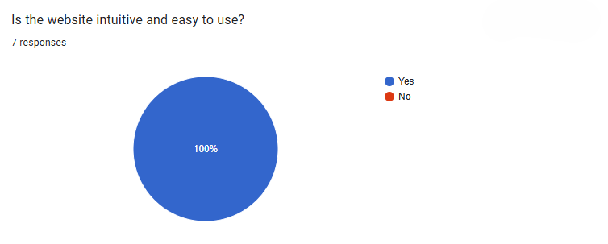

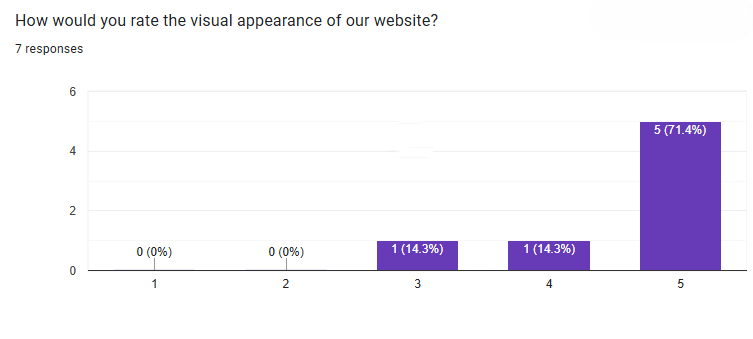

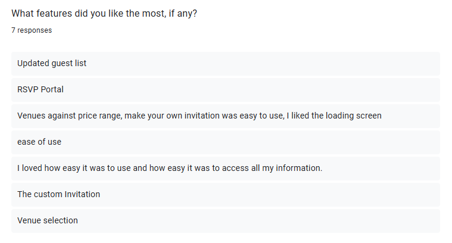

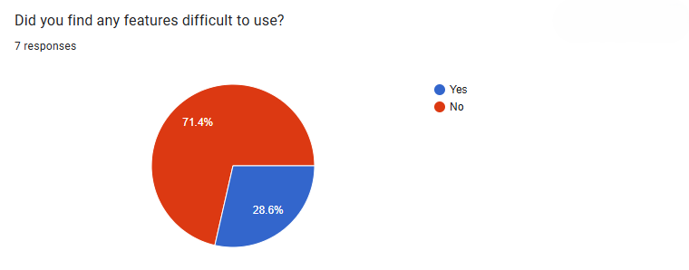

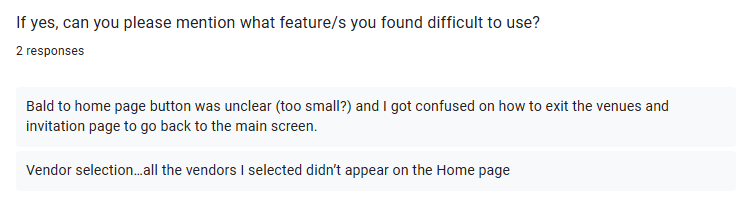

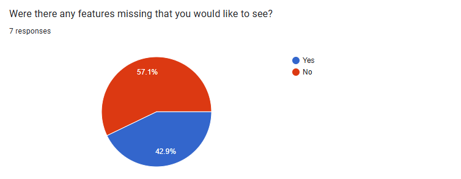

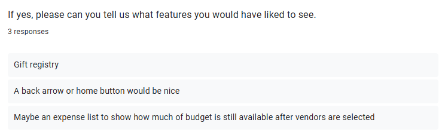

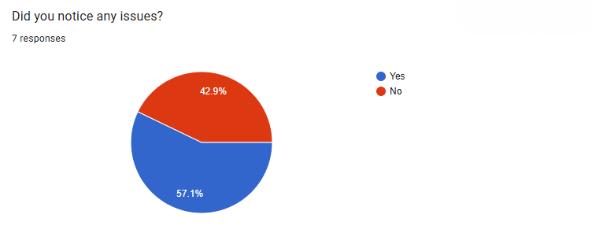

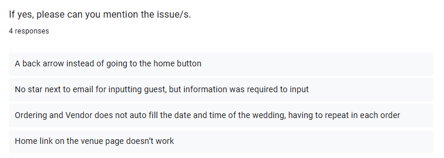

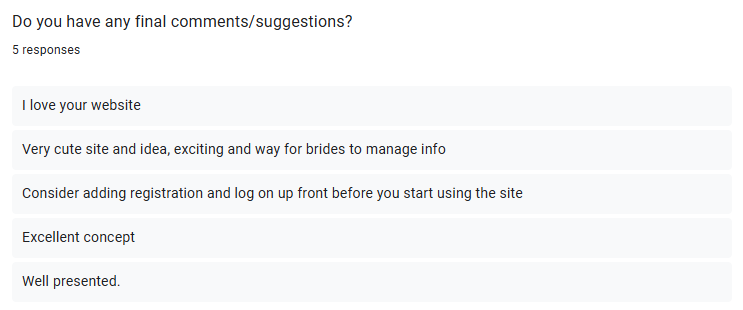

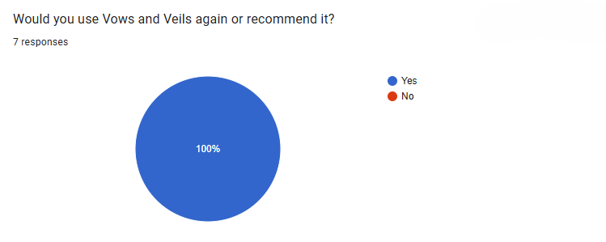

#### Discussion of results for second user testing

**Overall Experience:** Users gave positive feedback, with 100% of ratings being either 4 or 5 stars.

**Ease of use and visual appeal:**  All participants (100%) reported that the website is intuitive and easy to use. The visual appearance was also rated highly, with 71.4% giving it 5 stars.

**Features that users liked:**

- Updated guest list management
- RSVP portal
- Venues filtering by price range
- Invitation creation and loading screen design
- General ease of use and accessibility of information

**Features that users would have liked to see:**

- Gift registry functionality
- Back arrow or a clearer home button for easier navigation

**Difficulties reported**

- Confusion about navigating back from venues/invitations page
- Lack of clarity in guest email input (required field but not marked clearly)
- Ordering and vendor forms did not auto-fill date and time, requiring repetition across multiple entries

**Overall Recommendation:** 100% of respondents indicated they would use Vows and Veils again or recommend it to others.

#### Integration of feedback
**Prefilled vendor order form**
Users reported that completing the order form was time-consuming and confusing. In response, the form was updated to prefill key user information where possible, reducing manual input and improving efficiency.

**Improved Navigation**
Feedback indicated that users struggled to locate the homepage quickly. To address this, the home button was made larger and more prominent, improving visibility and navigation across the platform.

**Updated "Add guest" feature**
Feedback indicated that users did not know they had to include a guest email when adding a guest as there was nothing to indicate this, which made it difficult for users to add a guest. To address this, an asterix was added next to the email section for guests to indicate it as a required field.

---

## Bug Tracker

Our project used Github Issues as the bug tracking tool. Github Issues allowed us to log bugs, assign them to team members, prioritize tasks, and track progress directly within our project repository. This ensured that all bugs were documented and visible to the whole team in order to be resolved. 

### Bug reporting

When a bug is discovered in the project, a new Issue is created in the repository with the following details:

- Title: A short clear description of the bug.
- Description: A detailed explanation of the bug including the expected vs actual behaviour.
- Labels: Used to identify if it is backend or frontend.
- Assignee: The team member responsible for fixing the bug.

### Workflow

We follow a standard Github Issues workflow whereby bugs are,

- Open: The bug has been reported.
- Assigned: A team member has been assigned to fix the bug.
- In progress: Work is going on to fix the bug.
- Closed: The bug has been fixed, tested, and merged.

### Activity and communication

- **Number of Issues: 8** bugs were logged in Github Issues during the project. Each issue was updated regularly until resolution, ensuring progress was visible to the whole team.
- **Team Communication:** Team members discussed bug causes, suggested solutions, and confirmed fixes in project meetings. Additionally, commits were linked to corresponding issues to show which changes addressed each bug.

### Proof

The screenshot below shows that our team actively used Github Issues to track bugs throughout the project. It shows that all issues were logged, assigned, and closed during development. 


---

## Database documentation

For this project, it was decided to use Firebase Firestore as our database. 

### Database schema

Our database schema defines how our data is structured, stored, and accessed within the application. The database schema is designed to support the core functionality of the application by organizing data into collections and documents in Firestore. Each collection groups related data, while documents store individual records with fields and types

- **Admins, Companies, Venues/Vendors:** Manage user accounts and company listings.
- **Events and Orders:** Enable couples to create events and select venues/vendors, linking all relevant information.
- **Guests:** Store RSVP responses, dietary requirements, and song requests, which drive interactive features like guest lists and dashboards.
- **Story** Allows couples to create their own relationship story which would then be shown to guests when they RSVP.
- **Notifications** Allows companies to recieve notifications about the status of their service from the admin.
- **Real-time updates:** Firestore ensures that any changes made by admins, vendors, or users are immediately reflected across the app, keeping data consistent and interactive.

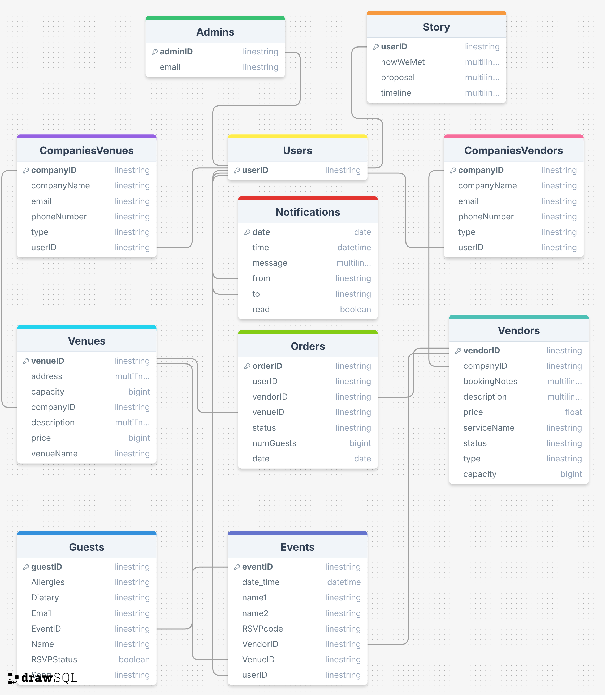

| **Collection** | **Description** | **Documents** |
| --- | --- | --- |
| Admins | Store the email address of all admin users. | email → email address of admin user |
| CompaniesVenues | Store the information about all companies that have venues available on the website. | companyName → name of the company <br> email → email address of the company to be used when contacting <br> phoneNumber → phone number of the company to be used when contacting <br> type → the type of company is venue <br> userID → the userID of the person making the company |
| CompaniesVendors | Store the information about all companies that have vendor services available on the website. | companyName → name of the company <br> email → email address of the company to be used when contacting <br> phoneNumber → phone number of the company to be used when contacting <br> type → the type of company is vendor <br> userID → the userID of the person making the company |
| Venues | Store all available venues that companies have added and that couples can choose from. | address → the physical address of the location <br> capacity → maximum number of guests the venue can have <br> companyID → the companyID of the company owning the venue <br> description → a short description of the venue <br> price → the price of the venue <br> venueName → name of the venue <br> status → status as changed by admin |
| Vendors | Store all available vendor services that companies have added and that couples can choose from. | bookingNotes → notes couples must be aware of when booking <br> capacity → maximum number of guests the vendor service can provide for <br> companyID → the companyID of the company owning the vendor service <br> description → a description of the vendor service <br> price → the price of the vendor service <br> serviceName → name of the vendor service <br> status → status as changed by admin <br> type → category of vendor service |
| Orders | Store the information of the couples' selected venue and vendor services. | customerID → the userID of the customer making the selections <br> guestsNum → the number of guests booked for <br> vendorID → the id of the chosen vendor service <br> venueID → the id of the chosen venue <br> vendorStatus → status as changed by vendorCompany <br> venueStatus → status as changed by venueCompany |
| Guests | Store the information about guests who have completed the RSVP form. | allergies → allergies that the guest may have <br> dietary → dietary requirements that the guest may have <br> email → email address of the guest <br> eventID → the eventID that the guest is completing an RSVP form for <br> name → name of the guest <br> RSVPstatus → indicating if the guest is attending or not <br> song → song request made by the guest |
| Events | Store the wedding details as chosen and decided by the couple. | date_time → date and time of the wedding <br> name1 → name of the first partner <br> name2 → name of the second partner <br> RSVPcode → guests use this to RSVP to a couple's wedding <br> eventID → the userID of the person creating the event <br> vendorID → the id of the chosen vendor service <br> venueID → the id of the chosen venue service |
| Story | Store the couple's relationship story as inputted by the couple | userID → the unique ID of the user creating the story <br> howWeMet → text as inputted by user describing how they met <br> proposal → text as inputted by the user describing their proposal <br> timeline → an array of milestones as inputted by the user  |
|Notifications| Store notifications for companies as sent by the admin | date → the date that the notification was sent by a user <br> from → indicates the type of user that sent the notification <br> message → the actual notification <br> read → indicating if the notification has been seen by the recieving user <br> to → the userID of the person recieving the notification |


### Justification and reasoning

**Scalability:**

Firestore is a scalable, fully managed, and cloud-hosted database that automatically adjusts to accomodate an increasing number of users and data volume. Firestore adjusts storage and provisions resources automatically, which eliminates the need for manual management by team members. This ensures performance remains consistent, even during high traffic periods. This is important for our web application to ensure that the project is able to handle growth without requiring manual adjustments.

**Real-time updates:**

Firestore offers real-time synchronization of data across all connected clients. When a document is uploaded, updated, or deleted, all users will be able to see the changes instantly without the need to refresh their application. This ensures that interactive features, such as a live dashboard for our guests RSVP is up-to-date at all times. 

**Security:**

Firestore includes built-in authentication and security rules that control who has access to data to be able to read or write. We are able to ensure secure access policies for different parts of the database by linking data access to user identity and user roles. This reduced the risk of unauthorized access to data, and ensures confidentiality and integrity of user data.

**Cloud-hosted:**

Firestore removes the need to manage physical servers or storage devices as it is fully cloud-hosted. This allows our team to fully focus on the web application and user experience rather than on infrastructure management. Cloud hosting also provides automatic backup and high availability which reduces the risk of data loss. 

### Proof of deployment

The database was deployed on Firebase Firestore and connected to the Angular frontend, allowing the application to read and write data in real time. Screenshots from the Firebase console show: collections and documents populated with data, configured security rules, and activity that demonstrates the database is actively supporting the application.

**Collections and Documents:** 

All collections are populated with sample and real project data, demonstrating that the database structure matches the documented schema.

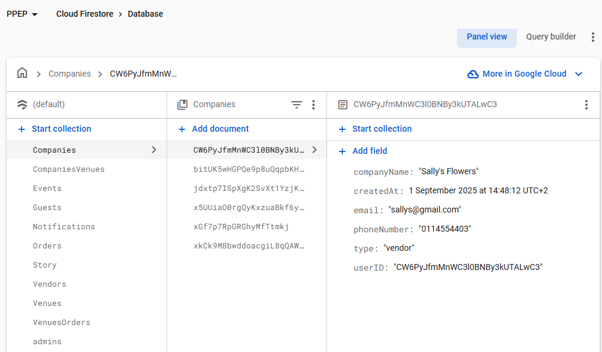

**Security Rules:** 

Access rules are configured to ensure that only authorized users can read or write specific data.


**Active Use:** 

Updates to documents in Firestore correspond to actions in the application, such as creating events, adding venues, or submitting RSVP responses, showing that the database is actively supporting the application in real time.

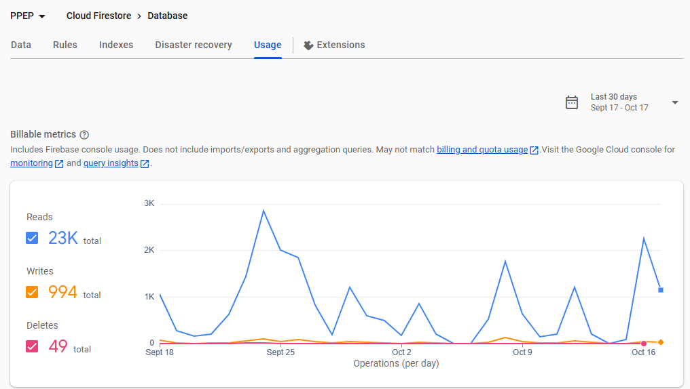

---

## Third-party code documentation

### Visual Crossing weather API

To improve the functionality of the site and provide added value to users, the project integrates an external service, which is the Visual Crossing Weather API. This API supplies real-time weather conditions and forecasts, which are displayed directly on the homepage. The inclusion of this feature is important because it allows users to access accurate and current weather information while using the platform. By using the weather data within the site, users have direct access and do not need to consult seperate sources, resulting in a more effecient user experience. 

The integration was carried out by connecting the homepage to the Visual Crossing API endpoint and retrieving weather data in JSON format. The relevant details, such as temperature, conditions, and forecasts, are extracted and presented to users. Official API documentation was used throughout the process to guide setup, authentication, and request handling, while error-handling measures were implemented to maintain reliability in the event of service interruptions. Through this integration, our team demonstrated effective use of external resources to extend services.

### Leaflet
To improve the functionality of the site and provide added value to venue companies, we integrated an external service, which is the Leaflet.js Interactive Map API. This API enables interactive mapping features that allow venue companies to find and confirm venue addresses directly within the platform. The inclusion of this feature is important because it provides a more accurate and efficient method of selecting locations, reducing errors and eliminating the need for users to rely on separate mapping tools.

The integration was carried out by embedding a Leaflet map within the venue management section of the site. The map was initialized with OpenStreetMap tiles, and interactive features such as zooming, panning, and marker placement were enabled. When a user clicks on the map, a marker is added at the selected location and the latitude/longitude coordinates are captured for storage and further use in the system. Popups provide immediate visual confirmation of the selected venue location.

Official Leaflet documentation was used throughout the process to guide setup, map initialization, and event handling. Error-handling measures were also included to ensure the system remains functional in cases where map tiles fail to load or unexpected input occurs. Through this integration, our team demonstrated effective use of open-source resources to extend the system’s capabilities and provide users with a reliable, interactive mapping experience.

### Hugging Face
To improve platform usability and provide real-time user support, we integrated the Hugging Face Chat Completion API. This API powers the platform’s chatbot feature, which helps couples, guests, and vendors navigate the site, access guidance, and receive instant answers to common questions. The inclusion of this feature was important because it enhances user experience and ensures users can find help directly within the platform without needing external assistance.

The integration was implemented by connecting the chatbot interface to the Hugging Face API endpoint. When a user sends a message, the system forwards it to the API, which returns a context-aware response that is displayed in the chat window. Error-handling mechanisms were included to maintain reliability in cases of connection failures or invalid responses, ensuring smooth and uninterrupted chatbot interactions.

The team utilized official Hugging Face documentation to guide the integration process, including API request formatting and response management. Alternative APIs, such as OpenAI’s GPT and Google Dialogflow, were explored; however, Hugging Face was selected for its balance of flexibility, affordability, and ease of integration. Through this integration, the team effectively improved accessibility and user support within the platform while maintaining a scalable and efficient technical solution.

### Firebase Authentication

We use Firebase Authentication to handle secure Google sign-ins for both couples and company accounts (vendors and venues). This allows users to log in safely without managing passwords in our system, and it provides a reliable authentication flow that integrates with our Firebase backend.

**Usage in our project:**

- Couples: Sign in to access the homepage and begin planning their wedding. Once they have signed in, they can access features such as venue selection, vendor selection, invitation creation, and guest management.
- Companies (vendors and venues): Sign in to create or access company accounts and dashboards. Once they have signed in, they can access features such as adding or deleting services from their company.

**The process:**

1. When a user clicks a Google sign-in button, Firebase Authentiction triggers a Google OAuth flow.
2. Firebase validates the user credentials and returns a secure token.
3. The application checks if the user already exists within the database:
- If the user does not exist in the database, they are prompted to create a company account or their wedding event for couples.
- If the user does exist in the database, they are redirected to the appropriate dashboard based on their role.
1. The authentication state is maintained in the client application to manage user sessions.

**Reasoning and choice:**

- Provides secure and trusted authentication without managing passwords manually.
- Supports multiple authentication providers for future flexibility. We currently use Google.
- Integrates seamlessly with our Firebase Firestore database to store user and company data.
- Simplifies session management and reduces the risk of security vulnerabilities.

**References:**

https://firebase.google.com/docs/auth/web/google-signin

---

## Testing

### Automated testing

We used automated testing tools to ensure the correctness of our application code. 

**Unit Testing**

- Conducted using the Karma test runner.
- Focused on testing individual components, services, and utility functions.
- Examples of unit tests include:
    - Form validation for RSVP submissions.
    - Event creation logic to ensure correct data is stored in the database.
    - Vendor and venue listing components to verify correct rendering and data binding.

Running unit tests:

To execute unit tests with the Karma test runner, run the following command in the project directory:

```jsx
ng test
```

This will run all unit tests and display results in the console or browser. Unit tests cover important components, such as form validation, event creation, and data handling.

**End-to-end testing**

- Simulates user actions in the application to verify that features work as intended in real-world scenarios.
- Examples of E2E tests:
    - User registering for an event and submitting RSVPs.
    - Admin adding a new venue or vendor and checking visibility on the site.
    - Couples selecting vendors and verifying order information is saved correctly.

Running end-to-end tests:

For end-to-end testing, run:

```jsx
ng e2e
```

Angular CLI does not include an E2E testing framework by default, so we can configure one. E2E tests simulate user actions, such as navigating the site, creating events, and submitting RSVPs.

**Code coverage**

Code coverage was monitored using Codecov, which shows the percentage of code covered by automated tests. This helps identify untested parts of the application and ensures that new changes do not break existing functionality.


Code coverage link:

[https://app.codecov.io/gh/Pixel-Perfect-SDP/Vows-n-Veils](https://app.codecov.io/gh/Pixel-Perfect-SDP/Vows-n-Veils)

### User testing and feedback

User testing complements automated testing by evaluating usability, user experience, and interface design. A formal process was followed to ensure systematic collection and use of feedback.

**Feedback collection**

1. **Design:** A structured feedback form was created with questions covering usability, intuitiveness, visual design, features, issues, and overall satisfaction.
2. **Distribution:** The form was distributed to a sample group of users representing the target audience.
3. **Recording:** Responses were systematically collected via Google Forms. 

**Results of the feedback form**

User feedback was positive, with 100% of participants rating the website 4 or 5 stars. All users found it intuitive and visually appealing. Popular features included the wedding countdown, guest list management, invitation creation, and pre-loading of venues and vendors, which made planning more efficient. Users suggested additional features such as per-person food pricing, RSVP deadlines, dress codes on invitations, venue maps, gift registry links, weather forecasts, and a translation system. Reported difficulties included the countdown timer loading slowly, inability to switch tabs after login without logging out, and weather information not displaying correctly. Despite these minor issues, 100% of users said they would use the website again or recommend it to others.

**Integration of feedback**

- Based on user feedback results, we decided to integrate a weather API system that is displayed on the home to improve the website and incorporate suggestions.
- Planned changes will be implemented in the code and reflected in automated tests (unit and E2E).
- This creates a continuous feedback loop, ensuring that user input directly informs development, testing, and refinement of the website.

### Using the tests

- Run ng test for unit tests and ng e2e for end-to-end tests.
- Refer to Codecov reports to identify areas that require additional test coverage.
- After user feedback is collected, tests are updated to ensure issues identified by users are addressed.

---

### Manual unit tests

#### Admin page unit tests

| Test | What it Does | How it Works |
|------|--------------|--------------|
| `it('should create component', ...)` | Verifies that the Admin component is successfully created | Uses `expect(comp).toBeTruthy()` after TestBed initialization |
| `it('should initialize with empty arrays and loading states', ...)` | Ensures vendors and venues arrays start empty and loading states are false | Checks `vendors`, `venues`, `loadingVendors`, and `loadingVenues` after setup |
| `it('should call fetchVendors and fetchVenues when user exists', ...)` | Confirms both data-fetching methods are triggered when a user is logged in | Spies on `fetchVendors` and `fetchVenues`, calls `ngOnInit()`, and verifies both are called |
| `it('should navigate to landing when no user', ...)` | Redirects unauthenticated users to the landing page | Mocks `getUser` to return `null`, calls `ngOnInit()`, and expects navigation to `/landing` |
| `it('should fetch vendors successfully', ...)` | Ensures vendor data loads properly from Firestore | Calls the private `fetchVendors()` method and confirms `loadingVendors` is set to `false` |
| `it('should handle vendor fetch error', ...)` | Tests error handling for vendor fetch failures | Forces an error in `fetchVendors`, spies on `console.error`, and checks logged error |
| `it('should fetch venues successfully', ...)` | Ensures venue data loads properly from Firestore | Calls the private `fetchVenues()` method and confirms `loadingVenues` is set to `false` |
| `it('should handle venue fetch error', ...)` | Tests error handling for venue fetch failures | Forces an error in `fetchVenues`, spies on `console.error`, and checks logged error |
| `it('should change vendor status to approved', ...)` | Confirms that vendor approval updates Firestore and removes vendor from list | Calls `changeStatus('Vendors', 'vendor1', 'approved')` and checks vendor is removed |
| `it('should change venue status to rejected', ...)` | Verifies that venue rejection removes it from the local list | Calls `changeStatus('Venues', 'venue1', 'rejected')` and ensures venue is removed |
| `it('should handle status change error for vendors', ...)` | Confirms errors during status change are handled gracefully | Forces an error in `changeStatus`, spies on `console.error`, and verifies message |
| `it('should handle unknown collection in changeStatus', ...)` | Ensures unknown collections do not affect existing data | Calls `changeStatus` with an invalid collection and checks vendors/venues unchanged |
| `it('should sign out and navigate to landing', ...)` | Confirms that logout clears storage and redirects to landing | Spies on `navigate`, `localStorage.clear`, and `sessionStorage.clear`, then checks calls |
| `it('should handle logout errors gracefully', ...)` | Verifies that logout failures are caught and logged | Forces logout error and checks `console.error` output |
| `it('should set loadingVendors to true during fetch', ...)` | Tests that the loading state updates properly while vendors are fetched | Uses a controlled Promise to verify loading flag changes before and after fetch |
| `it('should set loadingVenues to true during fetch', ...)` | Tests that the loading state updates properly while venues are fetched | Uses a controlled Promise to verify loading flag changes before and after fetch |
| `it('should clear arrays on ngOnDestroy', ...)` | Ensures component cleanup removes vendors and venues data | Calls `ngOnDestroy()` and verifies arrays are emptied |
| `it('should handle empty vendor results', ...)` | Tests Firestore returning no vendors | Sets mock vendor data to empty and ensures resulting array is also empty |
| `it('should handle empty venue results', ...)` | Tests Firestore returning no venues | Sets mock venue data to empty and ensures resulting array is also empty |

---

#### Chatbot unit tests

| Test | What it Does | How it Works |
|------|--------------|--------------|
| `it('should create', ...)` | Confirms the `Chatbot` component is instantiated successfully | Uses `expect(component).toBeTruthy()` after TestBed setup |
| `it('should call loadFAQs on initialization', ...)` | Ensures FAQ data loads when the component initializes | Spies on `loadFAQs()` and checks it's called in `ngOnInit()` |
| `it('should log to console on init', ...)` | Verifies that console logs show chatbot initialization | Spies on `console.log` and expects `"Chatbot loaded"` message |
| `it('should load FAQs successfully', ...)` | Checks FAQ data is fetched and messages initialized | Mocks `/assets/faq.json`, flushes mock data, and checks FAQs and greeting message |
| `it('should handle error when loading FAQs', ...)` | Confirms chatbot handles FAQ load errors gracefully | Forces a 500 error on `/assets/faq.json` and checks fallback message |
| `it('should toggle chat open and closed', ...)` | Ensures chat popup opens and closes correctly | Calls `toggleChat()` twice and checks `isOpen` toggles true/false |
| `it('should toggle minimize state', ...)` | Verifies minimizing and restoring the chat window | Calls `minimizeChat()` and checks `isMinimized` toggles |
| `it('should close chat completely', ...)` | Checks that closing resets both open and minimized states | Calls `closeChat()` and verifies `isOpen` and `isMinimized` are false |
| `it('should add user and bot messages when FAQ selected', ...)` | Confirms correct message flow on FAQ click | Calls `selectFAQ(faq)` and checks two messages are added (user + bot) |
| `it('should ignore empty or whitespace input', ...)` | Prevents sending blank messages | Tests `sendMessage()` with empty and whitespace-only input |
| `it('should skip sending when isLoading is true', ...)` | Ensures no duplicate messages while waiting for response | Sets `isLoading = true` and checks no new message is added |
| `it('should send message and find keyword match', ...)` | Confirms FAQ match detection in send flow | Sends user input with known keywords and verifies correct FAQ answer |
| `it('should call AI search when no keyword match', ...)` | Uses AI when FAQ keywords don’t match | Spies on `findAnswerWithAI()` and checks it’s triggered correctly |
| `it('should find FAQ by keyword or partial match', ...)` | Tests keyword and substring search in FAQs | Calls `searchByKeywords()` with variations of matching text |
| `it('should return null for no keyword match', ...)` | Ensures no result for unrelated queries | Passes unmatched question and checks result is null |
| `it('should handle case-insensitive matching', ...)` | Confirms matching works regardless of input casing | Calls `searchByKeywords('GUESTS')` and verifies match |
| `it('should find best AI match from high score', ...)` | Tests Hugging Face API integration for best match | Mocks `httpClient.post` returning `{ scores: [...] }` and checks selected answer |
| `it('should return default message when score too low', ...)` | Handles low-confidence AI results gracefully | Mocks scores below 0.3 and verifies fallback response |
| `it('should handle AI request and subscribe errors', ...)` | Ensures chatbot recovers from API failures | Mocks `httpClient.post` to throw error and checks fallback message |
| `it('should handle threshold (0.3) and close scores', ...)` | Tests edge AI scoring conditions | Mocks scores near threshold to verify consistent output |
| `it('should add user message', ...)` | Ensures user message objects are added with correct fields | Calls `addUserMessage()` and checks message object contents |
| `it('should add bot message', ...)` | Confirms bot replies are added properly | Calls `addBotMessage()` and checks message object structure |
| `it('should send message on Enter key', ...)` | Tests keypress trigger behavior | Simulates `keypress` event and checks `sendMessage()` called |
| `it('should ignore Shift+Enter and other keys', ...)` | Ensures multiline input and non-Enter keys are ignored | Simulates Shift+Enter and random keypresses |
| `it('should reset messages on backtofaq', ...)` | Confirms chat reset to welcome message | Calls `backtofaq()` and checks only greeting remains |
| `it('should handle empty FAQ arrays', ...)` | Ensures no crash when FAQ data missing | Sets `faqs = []` and verifies `searchByKeywords()` returns null |
| `it('should handle multiple or empty keyword FAQs', ...)` | Handles complex or incomplete FAQ data | Tests keyword overlap and empty keyword lists |

---

#### Homepage unit tests

| Test | What it Does | How it Works |
|------|--------------|--------------|
| `it('fills eventDisplayInfo (title, venue, time, budget, guests, vendors)', ...)` | Verifies full event information loads successfully from Firestore | Mocks Firestore docs for event, venue, guests, and vendors; checks calculated `eventDisplayInfo` fields and side effects (`updateCountdown`, `fetchVenueAndWeather`) |
| `it('sets eventInfoError when no authenticated user', ...)` | Confirms behavior when there’s no logged-in user | Mocks `waitForUser()` to return null and ensures Firestore isn’t called and error is shown |
| `it('sets hasEvent=false when event document is missing', ...)` | Handles missing event documents gracefully | Mocks missing event doc (`exists() = false`) and checks `hasEvent` becomes false |
| `it('handles permission-denied when fetching vendors', ...)` | Ensures permission-denied Firestore errors don’t crash the app | Simulates permission-denied error on vendor fetch and expects `selectedVendors` to be null |
| `it('handles missing VenueID gracefully', ...)` | Verifies missing venue IDs skip venue fetching safely | Event doc without `VenueID` ensures venue call is skipped and `venueName` remains null |
| `it('uses fallback "Unknown Service" when vendor query is empty', ...)` | Checks fallback name logic for vendors when Firestore query returns no data | Returns empty vendor snapshot and verifies `"Unknown Service (companyID) (pending)"` used |
| `it('sets venueName to "Venue not found" when venue document is missing', ...)` | Handles missing venue documents cleanly | Mocks missing venue doc and ensures `venueName` shows `"Venue not found"` |
| `it('sets venueName to "Unable to load venue" when venue fetch throws', ...)` | Tests error handling for thrown venue errors | Forces rejection during venue fetch and checks fallback value and error logging |
| `it('keeps budget and RSVP code null when not present', ...)` | Ensures optional fields are safely null when missing | Mocks event doc without `Budget` or RSVP doc and verifies both remain null |
| `it('logs RSVP fetch error and keeps rsvpCode null', ...)` | Handles Firestore fetch errors when loading RSVP code | Forces RSVP read rejection and checks console error and null `rsvpCode` |
| `it('sets guest counts to 0 when guest query fails', ...)` | Ensures component resets guest counts when Firestore errors occur | Throws error on guest query and verifies counts set to zero with console error |
| `it('sets selectedVendors null when vendor query throws generic error', ...)` | Confirms fallback behavior for vendor fetch errors | Throws generic vendor read error and checks `selectedVendors` becomes null |
| `switchToGuests` | Loads guest filter options once, but reloads guests each time tab is opened | Calls `getGuestFilterOptions` and `getGuestsByEvent`; ensures options are cached and guests refreshed on each switch |
| `onFiltersChange` | Reloads guests using selected filter criteria | Converts form filter values to query params and calls `getGuestsByEvent` with correct `dietary`, `allergy`, and `rsvp` values |
| `submitAddGuest: validation error` | Ensures invalid form doesn’t submit | Leaves required fields empty and verifies `postGuest` is not called |
| `submitAddGuest: happy path` | Posts valid guest, refreshes guests, and closes add form | Fills form, trims whitespace, converts RSVP string to boolean, calls `postGuest`, refreshes guest list, and closes form |
| `onDeleteGuest: cancel path` | Verifies deletion canceled if user declines | `window.confirm` returns false; ensures `deleteGuest` not called |
| `onDeleteGuest: confirm path` | Deletes guest, refreshes list, and alerts success | `window.confirm` returns true; calls `deleteGuest`, refreshes guests, alerts success, clears loading |
| `onDeleteGuest: error path` | Handles delete errors gracefully | Simulates `deleteGuest` throwing; shows alert with error and clears loading |
| `onDeleteGuest: missing id` | Prevents deletion when guest id missing | Calls `window.alert` and returns early; `deleteGuest` not called |

---

#### Invitations page unit tests

| Test Block | What it Tests | Key Points |
|------------|---------------|-----------|
| `getVenueName` | Resolves venue name from Firestore or string, handles nulls | Handles `DocumentReference`, string IDs, missing venue, and missing `venuename` |
| `loadDefaultsFromEvent user load` | Early exit if no user, normal flow if user exists | Uses `waitForUser` spy; ensures form not modified if user missing |
| `backTohome` | Navigation function | Ensures `router.navigate(['/homepage'])` is called |
| `saveInvitation` | Handles early exits | Exits if no template selected or form invalid; waits for user |
| `downloadCanvasPNG` | Generates PNG from template and photo | Skips if no template, calls `loadImage` and `drawRoundedImage` when template present; triggers download |
| `loadImage` | Loads image asynchronously | Resolves on successful load, rejects on error |
| `choose` | Template selection | Sets `component.selected` to chosen template |
| `onPhotoChange` | Handles file input change | Sets `photoUrl`, revokes previous URL, ignores if no file |
| `ngOnInit` | Initialization flow | Exits if no user; hydrates invitation if Firestore snap exists (commented-out test) |
| `saveInvitation full` | Exits on invalid form or missing user | `hasInvite` remains `null` |
| `downloadCanvasPNG fallbacks` | Handles background image load failure | Uses plain fallback if `bg` load fails; ensures canvas drawing and URL creation |
| `drawRoundedImage` (commented-out) | Draws rounded image on canvas | Ensures all canvas path and drawing methods called correctly |

---

#### Landing page unit tests

| Test | What it Does | How it Works |
|------|--------------|--------------|
| `it('should create', ...)` | Confirms the `Landing` component is instantiated successfully | Uses `expect(component).toBeTruthy()` after TestBed setup |
| `it('should toggle companies popup', ...)` | Verifies that the companies popup toggles on and off | Calls `toggleCompaniesPopup()` twice and checks `companiesPopup` switches between `true` and `false` |
| `it('should call signInAndRedirect for vendor', ...)` | Ensures vendor Google sign-in works and navigates to vendor dashboard | Calls `onGoogleVendor()`, expects `mockAuth.signInWithGoogle` and `mockRouter.navigateByUrl('/vendors-company')` |
| `it('should call signInAndRedirect for venue', ...)` | Ensures venue Google sign-in works and navigates to venue dashboard | Calls `onGoogleVenue()`, expects `mockAuth.signInWithGoogle` and `mockRouter.navigateByUrl('/manageservices')` |
| `it('should call signInAndRedirect for admin', ...)` | Ensures admin Google sign-in works and navigates to admin dashboard | Calls `onGoogleAdmin()`, expects `mockAuth.signInWithGoogle` and `mockRouter.navigateByUrl('/admin')` |
| `it('should handle errors in signInAndRedirect', ...)` | Confirms errors during Google sign-in are logged without crashing | Makes `signInWithGoogle` reject, calls `signInAndRedirect()`, checks `console.error` called with error |
| `it('should have current year', ...)` | Checks that `component.year` is set correctly | Compares `component.year` to `new Date().getFullYear()` |

---

#### Login page unit tests

| Test | What it Does | How it Works |
|------|--------------|--------------|
| `it('should create', ...)` | Confirms the `Login` component is instantiated successfully | Uses `expect(component).toBeTruthy()` after TestBed setup |
| `it('should cycle images on timer', ...)` | Verifies that the image indices (`idxA`, `idxB`, `idxC`) advance on a timed interval | Calls `ngOnInit()`, advances time with `tick()`, and checks each index increments modulo its pool length |
| `it('should handle image error correctly', ...)` | Ensures that when an image fails to load, the component skips to the next image | Calls `onImageError('A'/'B'/'C')` and checks that the corresponding index increments and wraps around the pool |
| `it('should call auth.signUp and navigate onSignUp', ...)` | Tests that sign-up uses AuthService with correct form values | Sets form fields, calls `onSignUp()`, and checks `mockAuth.signUp` is called with email, password, and name |
| `it('should call auth.signIn and navigate onSignIn', ...)` | Verifies that login calls AuthService with the entered credentials | Fills form with email/password, calls `onSignIn()`, and expects `mockAuth.signIn` to be called with those values |
| `it('should reset form and call auth.signOut onSignOut', ...)` | Confirms sign-out resets the form and calls AuthService.signOut | Sets form values, calls `onSignOut()`, then checks the form is cleared and `mockAuth.signOut` was called |
| `it('should call sendVerification onVerifyEmail', ...)` | Verifies that email verification is triggered and user is alerted | Spies on `window.alert`, calls `onVerifyEmail()`, checks `mockAuth.sendVerification` and the alert message |
| `it('should call resetPassword onResetPassword with email', ...)` | Ensures password reset works when email is provided | Sets form email, calls `onResetPassword()`, expects `mockAuth.resetPassword` with the email and an alert shown |
| `it('should not call resetPassword onResetPassword without email', ...)` | Prevents password reset if no email is entered | Leaves form email empty, calls `onResetPassword()`, ensures `mockAuth.resetPassword` is not called and alert shows "Enter your email first" |
| `it('should call Google sign-in and navigate onGoogle', ...)` | Tests Google authentication is triggered | Calls `onGoogle()` and expects `mockAuth.signInWithGoogle` to be called |
| `it('should call linkGoogle onLinkGoogle', ...)` | Confirms linking Google account works and user gets feedback | Calls `onLinkGoogle()`, expects `mockAuth.linkGoogle` and an alert saying "Google linked to your account." |

---

#### Manage services page unit tests

| Test | What it Does | How it Works |
|------|-------------|-------------|
| `it('should create', ...)` | Ensures that the Angular component instance is successfully created without errors. | The test checks that the component instance exists by calling `expect(component).toBeTruthy()`. If the component fails to instantiate, the test will fail. |
| `it('should initialize default values', ...)` | Confirms that all component properties are set to their expected initial state when the component is created. | Each property is individually checked using Jasmine's `expect` statements, for example, `expect(component.hasVenueCompany).toBeNull()`. This ensures the component starts in a predictable state. |
| `it('should validate form fields', ...)` | Tests that the reactive form controls enforce required field validation. | The test accesses the form controls with `component.form.get('controlName')` and checks for `required` errors using `hasError('required')`. This verifies that the form will prevent submission when mandatory fields are empty. |
| `it('should select venues option and fetch data when user is set', ...)` | Verifies that selecting the "Venues" option triggers fetching the list of venues when a user is logged in. | A spy is used on `fetchVenues()`, the component’s `select('Venues')` method is called, and the test checks that `selected` is updated and `fetchVenues` is invoked. |
| `it('should select venues option but not fetch when no user', ...)` | Ensures that when a user selects the "Venues" option without being logged in, the component still updates the `selected` value but does not proceed with actual data fetching. | The test sets `component.user = null` to simulate no logged-in user. It spies on `fetchVenues` and calls `select('Venues')`. The expectations confirm that `selected` is updated to `'Venues'` and that `fetchVenues` is invoked, which internally handles the “no user” case by showing an alert instead of performing an API call. |
| `it('should clear data when selecting non-venue option', ...)` | Ensures that switching to a non-venue option resets venue-related state variables. | The test sets `venues`, `editingVenue`, and `addingVenue` with sample data, then calls `select('Other')` and verifies that all venue-related properties are reset. |
| `it('should fetch venues successfully', ...` | Confirms that the component can retrieve venue data from the backend without errors. | The test mocks `HttpClient.get()` to return sample venues. After calling `fetchVenues()` and using `tick()` to process async calls, it checks that `venues` is updated and `loading` is set to `false`. |
| `it('should handle fetch venues error', ...` | Tests how the component handles errors when venue fetching fails. | The HTTP GET call is mocked to throw an error. The test then verifies that `console.error` is called and that `venues` remains empty, with `loading` reset to `false`. |
| `it('should not fetch venues when no user logged in', ...)` | Ensures the component prevents fetching venues if no user is authenticated. | The test sets `component.user = null` and calls `fetchVenues()`. It checks that an alert is shown and that no HTTP request is made. |
| `it('should start adding new venue', ...)` | Ensures the component enters "add venue" mode correctly. | Calls `AddVenue()`, which sets `addingVenue = true` and initializes `newVenueData.status` to `"pending"`. |
| `it('should cancel adding venue', ...)` | Verifies that starting an add can be cancelled. | Sets `addingVenue = true`, then calls `CancelAdd()`. The expectation checks that `addingVenue` is reset to `false`. |
| `it('should start editing venue', ...)` | Checks that selecting a venue for editing loads its data into the form. | Calls `UpdateVenue(mockVenue)`. The test confirms `editingVenue` is set to the passed venue and `updateData` is populated with its values. |
| `it('should cancel venue editing', ...)` | Ensures editing can be exited without saving changes. | Initializes `editingVenue` with a mock object, then calls `CancelUpdate()`. The test confirms `editingVenue` is cleared (`null`). |
| `it('should delete venue when confirmed', ...)` | Verifies that deleting a venue works when the user confirms. | Mocks `window.confirm` to return `true`, stubs `HttpClient.delete` to succeed, and spies on `fetchVenues`. After `DeleteVenue()`, the test checks the confirm message, the correct DELETE endpoint call, and that venues are reloaded. |
| `it('should not delete venue when cancelled', ...)` | Ensures that cancelling a delete does not call the backend. | Mocks `window.confirm` to return `false`. The test verifies that `HttpClient.delete` is never called. |
| `it('should handle delete venue error', ...)` | Confirms that errors during deletion are logged and surfaced to the user. | Mocks `HttpClient.delete` to throw an error, with `window.confirm` returning `true`. The test checks `console.error` is called, an alert is shown, and `loading` resets to `false`. |
| `it('should handle file selection for new venue', ...)` | Tests file upload handling for a new venue. | Simulates a file input event, calls `onFileSelected()`, and ensures `selectedFiles` is updated with the chosen files. |
| `it('should handle file selection for venue update', ...)` | Tests file upload handling for editing an existing venue. | Simulates a file input event, calls `onNewFilesSelected()`, and ensures `newUpdateFiles` is updated. |
| `it('should call logout method', ...)` | Verifies the component exposes a working logout method. | Checks `logout` is defined as a function and can be called without errors. It doesn’t mock Firebase here—just ensures the method exists. |
| `it('should toggle map visibility', ...)` | Confirms that the map display can be shown/hidden. | Checks initial `mapVisible = false`, calls `toggleMap()`, and expects it to flip to `true`. |
| `it('should search location successfully', ...)` | Tests successful address lookup on the map. | Sets `searchAddress`, mocks `getMapData` to return a fake location, calls `searchLocation()`, and uses `tick()` to resolve async. It verifies that the data is stored in `mapData` and `mapLoading` is set to `false`. |
| `it('should handle search location error', ...)` | Ensures the component handles failed address lookups gracefully. | Mocks `getMapData` to throw a 404 error, calls `searchLocation()`, and checks that `mapError` shows a helpful message and loading resets. |
| `it('should not search when address is empty', ...)` | Prevents wasted map lookups on an empty string. | Sets `searchAddress = ''`, calls `searchLocation()`, and verifies no API call is made. |
| `it('should not search when address is only whitespace', ...)` | Prevents wasted map lookups on blank/whitespace input. | Sets `searchAddress = '   '`, calls `searchLocation()`, and verifies no API call is made. |
| `it('should set map pin', ...)` | Confirms that clicking a location on the map sets the correct pin data. | Calls `setMapPin(lat, lon, address)` and verifies `mapPin` is populated with those values. |
| `it('should use location for new venue', ...)` | Ensures that the pinned map location can be applied to a new venue form. | Sets a mock `mapPin` and `addingVenue = true`, then calls `useLocationForVenue()`. The test checks that `newVenueData.address` is updated. |
| `it('should return correct venue type labels', ...)` | Validates that venue type keys are mapped to human-friendly labels. | Calls `getVenueTypeLabel()` with different keys (`'hotel'`, `'event_space'`, and `'unknown'`) and verifies the expected text labels. |
| `it('should navigate to track orders', ...)` | Ensures navigation to the order tracking page works. | Calls `trackorders()`, then checks `mockRouter.navigate` is invoked with the `['/trackorders']` route. |

---

#### Notifications unit tests

| Test Block | What it Tests | Key Points |
|------------|---------------|-----------|
| Component creation & defaults | Component initializes correctly | `notifications` empty, `loading` false, `user` set |
| `ngOnInit` no user | Handles absence of logged-in user | Logs warning, does not fetch notifications, `loading` false |
| `ngOnInit` fetch notifications | Loads notifications from API | Fetches via HttpClient, sets `notifications`, `loading` false |
| Sorting notifications | Ensures unread first | Notifications array sorted with unread (`read=false`) first |
| Mark unread as read | Marks unread notifications via API | Calls `put` for each unread notification; read notifications ignored |
| Date conversion | Handles Firebase Timestamps, string dates, null/undefined | All notifications get valid `Date` objects |
| Error handling fetch | API errors during fetch | Logs error, clears `loading` |
| Error handling mark-read | API errors when marking notifications | Logs error, does not break execution |
| Empty or undefined notifications | Handles empty array or missing notifications | `notifications` becomes empty, no mark-read calls |
| Loading state | Properly sets `loading` during fetch | `loading` true while fetching, false after |
| Navigation `backhome` | Navigates using history state or fallback | Uses `navigateByUrl` if history exists, else `navigate` to `/landing` |
| Multiple notifications | Handles multiple unread notifications | All unread notifications marked as read; order preserved |
| Incomplete/missing properties | Notifications missing `from`, `message`, or `date` | Still creates valid Date; properties may be undefined |
| Mixed read/unread sorting | Maintains correct order | Unread first, read last |
| No unread notifications | Skip marking read | `put` not called for already read notifications |
| Network errors | Handles fetch/mark-read failures gracefully | Logs errors, maintains correct `loading` state |

---

#### RSVP page unit tests

| Test | What it Does | How it Works |
|------|--------------|--------------|
| `it('should handle guest found and update Firestore document', ...)` | Confirms that a guest is correctly found and their RSVP details are updated in Firestore | Mocks Firestore’s `getDocs` to return a matching guest, calls `onSubmit()`, and checks that `updateDoc` runs, alerts success, and updates the success message |
| `it('should handle guest not found path correctly', ...)` | Ensures proper handling when the entered guest name does not exist in Firestore | Mocks `getDocs` to return empty, calls `onSubmit()`, and verifies an alert and message indicating the guest is not part of the wedding party |
| `it('should handle Firestore errors gracefully', ...)` | Verifies that the component handles Firestore errors without crashing | Forces `getDocs` to throw an error, calls `onSubmit()`, and checks that the error message `'Something went wrong'` is displayed |
| `it('should handle Event Code found and story exists', ...)` | Confirms correct logic when a valid Event Code and Story record are found | Simulates two Firestore calls (for Event and Story), calls `submitEventCode()`, and ensures `eventIdEntered` is `true` and `storyData` contains the story |
| `it('should handle Event Code not found', ...)` | Ensures proper feedback when an invalid Event Code is entered | Mocks `getDocs` to return empty, calls `submitEventCode()`, and verifies alert message `'Event Code not found'` and failure message `'Event Code not found'` |
| `it('should handle Firestore error during event code lookup', ...)` | Tests that Firestore errors during Event Code lookup are caught and reported | Forces `getDocs` to throw an error, calls `submitEventCode()`, and checks that `component.message` is `'Error checking Event Code'` |

---

#### Support page unit tests

| Test | What it Does | How it Works |
|------|--------------|--------------|
| `it('should create', ...)` | Ensures the `SupportPage` component is successfully created | Uses `expect(component).toBeTruthy()` to confirm Angular instantiates it without errors |
| `it('should select a section', ...)` | Checks that selecting a section updates the state properly | Calls `component.selectSection('example')`, then asserts `selectedSection` is updated and `searchTerm` is reset |
| `it('should go back and reset section and search term', ...)` | Verifies that going back clears the selection and search term | First sets a section and search term, then calls `component.goBack()` and checks that `selectedSection` is `null` and `searchTerm` is `''` |
| `it('matchesSearch should return true if searchTerm is empty', ...)` | Confirms that any item matches when no search term is provided | Sets `searchTerm = ''`, then calls `matchesSearch('anything')` and expects `true` |
| `it('matchesSearch should correctly match text', ...)` | Validates case-insensitive search matching | Sets `searchTerm = 'hello'`, checks `matchesSearch('Hello')` returns `true` and `matchesSearch('Goodbye')` returns `false` |

---
#### Track orders page unit tests

| Test | What it Does | How it Works |
|------|--------------|--------------|
| `it('should create', ...)` | Confirms component is instantiated successfully | Uses `expect(component).toBeTruthy()` |
| `it('should initialize with default values', ...)` | Ensures `orders` starts empty and `loading` is false | Checks `orders = []` and `loading = false` after setup |
| `it('should navigate back to manageservices', ...)` | Verifies back navigation works | Calls `component.backhome()` and expects `router.navigate(['/manageservices'])` |
| `it('should call orders API with correct company ID', ...)` | Ensures correct API URL is called | Mocks `http.get` and checks the request URL includes `/company/test-company-id` |
| `it('should load orders and fetch venue data', ...)` | Loads orders and resolves venue names | Stubs `http.get` for orders & venues, then checks venue name substitution |
| `it('should handle orders with no venue selected', ...)` | Replaces empty `venueID` with default label | Mocks an order with `venueID = ''` and verifies fallback `"No venue selected"` |
| `it('should handle venue fetch error gracefully', ...)` | Logs errors when venue fetch fails | Mocks `throwError` on venue API, spies on `console.error` |
| `it('should handle load orders API error', ...)` | Handles failure of the main API | Returns error from orders API, checks `console.error` and `loading = false` |
| `it('should sort orders by status priority', ...)` | Orders sorted `pending → accepted → rejected` | Provides mock data in mixed order, verifies correct ordering |
| `it('should use fallback venue name when venue has no name', ...)` | Substitutes missing `venuename` | Returns venue object without `venuename`, expects `"No venue name"` |
| `it('should set loading to true during loadOrders', ...)` | Confirms loading state is toggled | Calls `loadOrders` and expects `loading = true` immediately |
| `it('should handle empty orders response', ...)` | Works with empty API response | Returns `[]`, ensures `orders = []` and `loading = false` |
| `it('should handle multiple orders with different venues', ...)` | Resolves multiple venue names correctly | Stubs two venues, expects names `Venue One` and `Venue Two` |
| `it('should handle orders with null or undefined note', ...)` | Handles missing notes gracefully | Returns order with `note = null`, ensures no crash |
| `it('should update component state after successful loadOrders', ...)` | Ensures final state is consistent | Verifies orders are populated and `loading = false` |
| `it('should handle specific HTTP error codes for venue fetch', ...)` | Logs structured error objects | Returns `{status: 404}`, checks `console.error` call |
| `it('should handle malformed venue data gracefully', ...)` | Still processes orders with bad venue data | Returns `null` instead of venue object, ensures `orders` still populated |
| `it('should call update status API with correct parameters', ...)` | Ensures `PUT` request is made correctly | Calls `updateStatus('order-1','accepted')`, checks request body `{status:'accepted'}` |
| `it('should call update status API for rejection', ...)` | Confirms rejection status is sent | Calls `updateStatus('order-1','rejected')` |
| `it('should handle update status error', ...)` | Logs errors when API call fails | Returns `throwError`, expects `console.error` |
| `it('should handle network timeout during updateStatus', ...)` | Simulates timeout case | Returns `{name:'TimeoutError'}`, expects error log |

---

#### Venues page unit tests

| Test | What it Does | How it Works |
|------|--------------|--------------|
| `it('should create', ...)` | Confirms the `Venues` component is instantiated | Uses `expect(component).toBeTruthy()` |
| `it('should show/hide loading overlay based on loading state', ...)` | Displays loading overlay when `loading = true` and hides it when `false` | Sets `component.loading` and checks for `.loading-overlay` element in template |
| `it('should initialize with the correct default values', ...)` | Ensures component properties are initialized | Checks `venues = []`, `recommendedVenues = []`, `selectedVenue = null`, `hasExistingOrder = false` |
| `it('should display venues when available', ...)` | Renders venue list in the template | Assigns venues to `component.venues`, sets `loading = false`, checks `textContent` contains venue names |
| `it('should show recommended venues when available', ...)` | Renders recommended venues section | Sets `component.recommendedVenues`, ensures template displays their names |
| `it('should show detailed venue information when selected', ...)` | Displays full details for `selectedVenue` | Assigns a venue to `selectedVenue`, checks template `textContent` contains venue info |
| `it('should show chosen venue information when available', ...)` | Displays the chosen venue name | Sets `chosenVenueName` and expects it to appear in template |
| `it('should handle no chosen venue scenario', ...)` | Handles empty chosen venue gracefully | Sets `chosenVenueName = ''` and checks template |
| `it('should handle view venue button click when venues are available', ...)` | Calls `viewVenue` on button click | Spies on `viewVenue()`, clicks `.btn`, expects spy to be called |
| `it('should handle back to list button click when venue is selected', ...)` | Calls `backToList` on button click | Spies on `backToList()`, clicks `.btnbackToList`, expects spy to be called |
| `it('should handle choose venue button click when venue is selected', ...)` | Calls `selectVenue` on button click | Spies on `selectVenue()`, clicks `.btnSelectVenue`, expects spy to be called |
| `it('should handle button disabled states based on hasExistingOrder', ...)` | Verifies button states reflect `hasExistingOrder` | Sets `hasExistingOrder` and checks template behavior |
| `it('should have homepage navigation link', ...)` | Checks homepage link exists in template | Queries `a[routerLink="/homepage"]` and checks text content |
| `it('should display basic venue information', ...)` | Shows venue names and addresses in template | Assigns a venue to `venues` and checks `textContent` |
| `it('should handle empty states correctly', ...)` | Handles no venues gracefully | Sets `venues = []` and ensures template reflects empty state |
| `it('should initialize with values from the actual component', ...)` | Confirms all properties are defined on initialization | Checks `loading`, `chosenVenueName`, `venues`, `recommendedVenues`, `selectedVenue`, `hasExistingOrder` |

---

## Security audit report
Two supply chain attacks were reported in the Node Package Manager ecosystem, affecting widely used packages such as **debug**, **chalk**, and **tinycolor**. Since our project makes use of NPM dependencies, this incident provided an opportunity to audit our codebase and ensure we are not compromised by these attacks.

### Causes of the supply chain attacks
#### Debug and Chalk attack
- **Cause:** Malicious actors gained access to the NPM accounts of maintainers or injected malicious code through a compromised contributor account.  
- **Point of failure:** Weak or missing multi-factor authentication on publisher accounts.  
- **Attack method:** Injected malware designed to exfiltrate environment variables, credentials, and other sensitive data from projects that imported the affected versions.

#### Tinycolor attack
- **Cause:** A package maintainer’s account was compromised, allowing attackers to publish malicious versions of `tinycolor` and its downstream dependencies.  
- **Point of failure:** Compromised NPM credentials and insufficient monitoring of package releases.  
- **Attack method:** Published backdoored versions of `tinycolor` that spread into at least 40 dependent packages. The malware acted as a worm, attempting to replicate itself by stealing credentials and publishing new compromised packages.

---

### Compromised packages and versions

#### Debug and chalk attack
The following packages and versions were identified as compromised:


| Package              | Compromised version |
|----------------------|-------------------------|
| `debug`              | 4.4.2                  |
| `chalk`              | 5.6.1                  |
| `ansi-styles`        | 6.2.2                  |
| `supports-color`     | 10.2.1                 |
| `strip-ansi`         | 7.1.1                  |
| `ansi-regex`         | 6.2.1                  |
| `wrap-ansi`          | 9.0.1                  |
| `color-convert`      | 3.1.1                  |
| `color-name`         | 2.0.1                  |
| `is-arrayish`        | 0.3.3                  |
| `slice-ansi`         | 7.1.1                  |
| `color`              | 5.0.1                  |
| `color-string`       | 2.1.1                  |
| `simple-swizzle`     | 0.2.3                  |
| `supports-hyperlinks`| 4.1.1                  |
| `has-ansi`           | 6.0.1                  |
| `chalk-template`     | 1.1.1                  |
| `backslash`          | 0.2.1                  |

#### Tinycolor attack
The main compromised package was

| Package             | Compromised version |
|---------------------|-------------------------|
| `@ctrl/tinycolor`   | 4.1.1                  |

Other downstream packages were also impacted, including:
- `koa2-swagger-ui@5.11.2, 5.11.1`
- `ngx-color@10.0.2`
- `@nativescript-community/gesturehandler@2.0.35`
- `@nativescript-community/sentry@4.6.43`
- `@nativescript-community/ui-image@4.5.6`
- `@crowdstrike/commitlint@8.1.1, 8.1.2`

In total, more than 40 packages were compromised, with later reporting suggesting hundreds were probed in this campaign.

---

### Audit of our project
#### Package.json & lock file audit
A team member identified that `package.json` had been accidentally deleted, causing several dependencies to fail and preventing merges to the main branch. This was corrected, and dependencies were restored.

To verify whether our project was affected by the supply chain attacks, we ran

`
npm audit --json > audit-report.json
`

We also made use of dependabot.


#### Audit results
The results of running `npm audit --json > audit-report.json` are shown below,


#### Dependabot integration
We also used Github Dependabot, which continuously monitors our dependencies and raises pull requests when updates are available. This provides 
- Automatic alerts if a dependency is compromised.
- Safe, version-controlled updates with review workflows.
- Reduced reliance on manual audits alone.

Towards the end of our project, Dependabot identified a high-risk security issue in @angular/ssr, a package used in
 the frontend for server-side rendering. The vulnerability was a Server-Side Request Forgery (SSRF) flaw in the URL
 resolution mechanism, which could allow an attacker to trick the server into making unintended HTTP requests. This
 occurred because the package’s URL constructor could interpret paths starting with double slashes as attacker-controlled
 URLs. If left unpatched, it could have affected the security of server-rendered pages and potentially exposed sensitive
 internal endpoints. Dependabot automatically proposed a security update to upgrade @angular/ssr to a fixed version,  which we merged promptly. The team felt reassured knowing that a critical vulnerability was detected and addressed
 before it could impact the project, highlighting the value of continuous dependency monitoring.


#### Interpretation
The audit confirms that our project is not affected by the compromised packages and no vulnerabilities were flagged across our dependencies. With npm audit and Dependabot in place, our exposure to similar supply chain attacks is low.

 The security audit was an insightful and educational experience for our team. It highlighted the growing threat of supply
 chain attacks and the importance of proactive dependency management. Initially, resolving missing files and performing
 the audit was time-consuming, but it strengthened our understanding of secure development practices. The team felt
 reassured after confirming that our project was not affected and proud to have implemented long-term security measures
 that enhance the overall resilience of our system. The detection and timely fixing of the Angular SSRF vulnerability by
 Dependabot further emphasized the importance of continuous monitoring, giving the team confidence in the security of
 the deployed application.

### Mitigation and prevention measures

#### Protecting against supply chain attacks

- Use package-lock.json to pin versions and avoid pulling malicious updates automatically.
- Run npm audit and use third-party scanners regularly.
- Establish dependency review policies before introducing new packages.
- Where possible, rely on trusted mirrors.
- Continue leveraging Dependabot for automated version tracking and alerts.

#### Protecting against local malware infection

- Enforce two-factor authentication for developer and maintainer accounts.
- Maintain regular backups of `package.json` and critical config files.
- Apply branch protection rules to prevent broken or compromised code from reaching `main`.
- Integrate CI/CD pipeline security checks to block builds if compromised dependencies are found.
- Perform static code analysis and security scans before merging new code.
